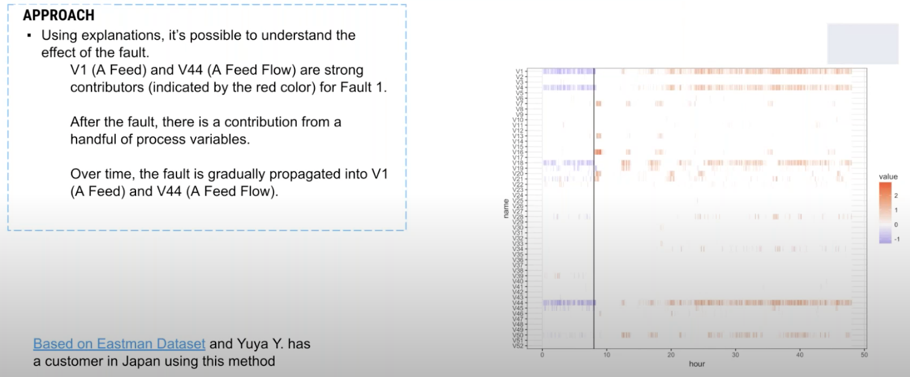

# Explanation Clustering

Notes from DataRobot's "Explanation Insights (with clustering)" [learning session](https://www.youtube.com/watch?v=EMfPOvBnSZ4&t=1s)[git repo](https://github.com/datarobot-community/pe-clustering-python).

## Explanations in DataRobot

Data Robot provides a prediction and a list of features with their contribution value (the amount they effect the prediction). Think of explanations as dimensionality reduction.

This is good for explaining a single row of data.

We can look at all the explanations for all the users to identify patterns;

You can use these explanations on time series data, or to generate personalised messaging for certain groups;

You can look at your explanations over time.

## Clustering

Explanation clustering is a technique to provide clusters based on the explanations of a supervised machine learning model.

It's very when you're in the unsupervised and clustering realm to try a lot of different techniques, to create the right number of clusters, but often these might not be connected to the underlying use case and can include features that are of little relevance.

The data is typically high cardinality data (cardinality refers to the number of values in a set), or text data, and therefore significantly increases the dimensions in our data and reducing the number of techniques available to us.

Explanation clustering allows us to start with our target first, as opposed to "what's related and near each other".

Explanation clustering clusters groups of predictions that have similar explanations. Clustering helps identify groups of features or patterns that summarise entire probability groups.

### Implementing explanation clustering

We need solid use case and finished predictive model.

We extract the explanations from the dataset. We pre-process the explanations and use a clustering algorithm to create groups.

We join those cluster ids back to get the characteristics of each cluster.

#### (1) Flatten the explanations

DataRobot provides a prediction for each row and the top ten predictive features.

There is a number under the `+++` (which says this feature drove the prediction up).

We reshape the data so that each row is still a prediction but each column is now representative of features and each cell is the strength of that feature.

DataRobot will use up to 50 features, giving us a matrix of n rows and max 50 columns. As a result the data can be sparse.

#### (2) Create explanation embeddings

Technically, you could skip this step and go straight to `K-means` but the following techniques are likely to improve the "meaningfulness" of your clusters.

We need to preprocess the data to get it suitable for clustering. We want to reduce the dimensionality of the clusters. Reducing dimensionality makes the density more apparent. As you collapse the feature space, you create pockets of density, areas of information "pull together".

Be aware there are a number of ways to bake a cake and you should experiment/investigate different approaches. DataRobot recommend using Uniform Manifold Approximation and Projection (UMAP) [reference paper Arxiv](https://arxiv.org/pdf/1802.03426.pdf). Alternative approaches would be Principal component analysis (PCA) or t-distributed stochastic neighbour embedding (t-SNE) [ref](https://lvdmaaten.github.io/tsne/).

> Uniform Manifold Approximation and Projection (UMAP) is a dimension reduction technique that can be used for visualisation similarly to t-SNE, but also for general non-linear dimension reduction. The algorithm is founded on three assumptions about the data:
> 
> 1. The data is uniformly distributed on a Riemannian manifold;
> 2. The Riemannian metric is locally constant (or can be approximated as such);
> 3. The manifold is locally connected.

We're going to leverage HDBSCAN for clustering (Hierarchical Density-based Spatial Clustering of Applications with Noise) [ref](https://towardsdatascience.com/a-gentle-introduction-to-hdbscan-and-density-based-clustering-5fd79329c1e8).

Unlike K-means, density-based methods work well even when the data isn’t clean and the clusters are weirdly shaped.

UMAP is non-linear and manifold aware (i.e. understands topological space in n dimensions)

> At a high level, we can simplify the process of density-based clustering into these steps:
> 1. Estimate the densities
> We need some method to estimate the density around certain points. One common way to do this is by using “core distance.” This is the distance of a point to its K-th nearest neighbour. This requires us to find the proper threshold to get meaningful clusters.
> 2. Pick regions of high density
> With the global threshold method, you might have a hard time when the clusters have varying densities. HDBSCAN first builds a hierarchy to figure out which peaks end up merging together and in what order, and then for each cluster it asks, is it better to keep this cluster or split it up into its subclusters?
> 3. Combine points in these selected regions
> We look at which density peaks “persists” more. Are there two mountains, or just one mountain with two peaks? Do we see the peaks more together or apart?

In the image below, the data has been reduced down to two dimensions;

#### (3) Get cluster labels

Having reduced our dimensions we run the clustering algorithm.

Each row is still a user/prediction.

HDBSCAN, our clustering algorithm, converts the feature space (now of two dimensions) according to density and sparsity in the data, and find clusters that are there. We don't provide a predefined number of clusters. The algorithm also identifies what it considers to be noise (it won't force users into a cluster if it has low confidence).

#### (4) Interpret clusters

We can join back to the original dataset and then begin to explore each cluster.

In the example below, we pivot the data and take the mean of each feature for each user in that cluster;

DataRobot can help to interpret the clusters.

Create a project where we try to predict whether a row of data belongs to a cluster or not. Say you have five clusters; you create a project in DataRobot using binary classification where you say "does this row belong to cluster one or not". Then we can the "feature impact" tool to determine which features determine whether a user belong to cluster one. You can also use other tools such as "partial dependence".

This will help to identify patterns of behaviour between clusters.

