# Blinkist Product Intelligence

## Strategy

Strategy informs metrics. Blinkist's number one strategic objective is to "create a meaningful product" that "brings the ideas from the best non-fiction to some of the busiest people on the planet". The existing north star metric, a metric that should best reflect the strategic objectives of the firm, is the number of `subscribers who have been content active on 5 or more distinct days in the last 28 days`.

### Evaluation

> Metrics become part of the language we use to discuss what’s happening, framing how we make decisions by denominating our goals, problems, and constraints. [ref](https://medium.com/@seanjtaylor/designing-and-evaluating-metrics-5902ad6873bf)

__Pros of the having a North Star metric__

- A North Star metric aligns disparate teams. It allows targeted coordination of what to optimise for. As a company grows, creating alignment and a common language among teams is the most important factor to determine velocity. You get everyone pulling in the same direction, with a shared objective approach to evaluating success.
- Having a North Star metric allows us to follow declarative logic (i.e. define the end state and let people figure out how to get there). As opposed to imperative logic which is akin to following a recipe, with each step detailed along the way. The most talented people often want to work in a declarative manner. It allows us to empower teams.

__Pros of the existing metric__

- This metric is deemed a good leading indicator of long-term engagement and renewal.
- The metric links to the "job-to-be-done" for the customer. People use Blinkist to learn, and being active (engaging with content) seems an appropriate proxy for the the customer satisfying that "job" and getting value from the product.
- The metric is "normalised", in this case the denominator is 28 days. We are essentially asking, out of 28 days, how many days are we successfully engaging customers.
- The metric focuses on the right "entity", in this case people. We don't care about books or a specific action but rather the number of people gaining value from the product.
- Not being 100% sure on what is meant by "content active", but is feels like an objective action, it's not based on user feedback but rather, did this person complete *x*.
- The metric has "low casual proximity" - we will be able to make changes in the product and know if they effect how a user engages with content. If we used revenue as a North Star metric, there's so many factors that feed into that, operating on varying feedback loops that it will be very hard for us to actually understand casual impact.
- The metric focuses on retention. Retention is the key to growth, regardless of what stage you're at.

__Cons, and an alternative__

- The metric could be perceived as complex. For those of us who live in the world of data we'll like the precision of "content active on 5 or more distinct days in the last 28 days". But this could be simplified to WAU - weekly active users. 
  - One word of warning on the definition of "active", we need it to be as universal as possible. For example, if FB had deemed active as someone performing a "like" the metric of MAU would have suffered from a large bias in participation rates.
  - It may make sense to have "active" mean simply opening the app for a certain period of time. This would allow us to review how people engage with the product.
- The metric is deemed a good leading indicator for renewals and long-term engagement. However, that makes it a good metric, but not necessarily a good North Star metric. 
  - Say I wanted to lose weight, my target weight should be my North Star metric. Everything else that feeds into that could be tracked on the same dashboard but I don't want to constrain myself in the factors I'm willing to consider. Calories, exercise, blood glucose levels, resting heart rate, anything that I think might feed into and contribute to that North Star metric is up for grabs.
  - WAU allows all teams to contribute, from marketing, to customer service, to partnerships, as well as product. Even SRE and back-end teams will contribute as performance and stability is often underestimated.
  - Ideally, our North Star metric will act as our counter-metric in experiments. For example, we might increase engagement at the expense of retention. WAU, is more generalisable and more suitable to acting as a counter-metric compared to the existing metric.
  - WAU provides a faster feedback loop than 28 days, allowing us to increase the tempo of which we evaluate success.
- I'm a fan of having a North Star metric, though I think this can be supplemented with a concept borrowed from OKRs (objective, key results). In the OKR framework, objectives are to some extent quantifiable (often boolean) but they're also a more aspirational. They can be powerful in articulating what the team's mission and focus is for the next 3-6 months. Typically, though not always true, people don't want to come to work and think they're trying to move a metric, they want to be inspired by their work.

A bit more on the case for using Weekly Active Users

- A standard metric like this can be looked at in a number of ways, allowing us to use existing frameworks, such as
  - Growthing accounting: on a daily/weekly/monthly basis you can bucket users into "churned", "retained", "new" or "resurrected". This simple framework is powerful, it allows us to identify areas of opportunity quickly.
  - L28: take the last 28 days and plot a histogram, what percentage of users were active 1 day, all the way up to 28. Most apps typically resemble a smiling curve.
- Blinkist wants to build a product people deem essential, a destination they go to learn. We shouldn't hide from having a challenging metric, with active people on a weekly time scale.
- Metrics become part of the language we use to discuss what’s happening, framing how we make decisions by denominating our goals, problems, and constraints. WAU is simple and capable of being commonly referred to, as opposed to the existing North Star metric.

### How to roll out a new north star metrics

I believe the best way to approach metrics is to think of them as a constellation. Metrics reflect the reality of your business, and no element of your business exists in a silo. To the extent possible it is worth displaying how you think metrics fit together.

Below is a rough and illustrative example, we start with the big question the business needs to answer, then review the business outcomes we need to see. We want our North Star metric to align with those outcomes, then we'll have a number of metrics that feed into that North Star metric.

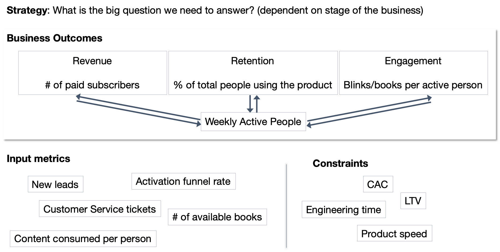
  
Taken a level deeper, each team could have a number of "output metrics" that they are responsible for, and the key input metrics they believe influence that outcome.
  
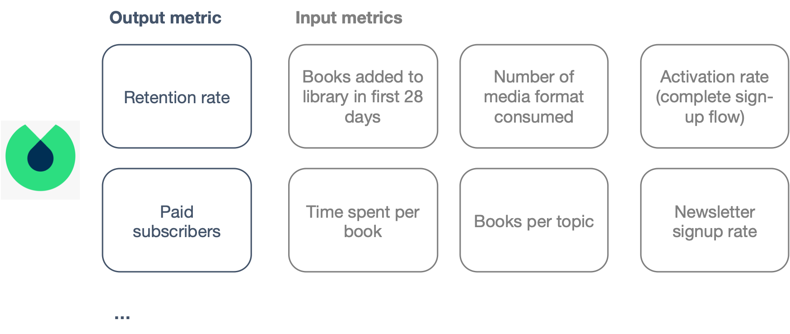
  
This process allows everyone in the business to have a clear understanding of our why, how everything fits together.
 
Simon Sinek has the concept of "the golden circle". You start with why.
 
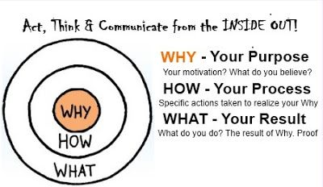

- Why are we thinking about changing the north star metric?
  - people don't want vacuity of thought, show them you're working and explain your why
- How are we going to come about choosing a north star metric?
  - Robert Caldini's Influence offers us a number of lessons that are equally important. Particularly in regards to reciprocity, consistency and authority.
  - Don't blind-side people. Be transparent. Say "our north star metric is currently under review, here is the plan, if you want to input please get in touch." Then provide weekly updates, perhaps on Slack or a "living notion document". Then get feedback from people directly. Be very opionated about who you need feedback from, don't just seek volunteers.
- What did we come up with?
  - Meet people where they are. Some people want to review code, some want to read a long-form doc, some people want a meeting to chat, others want a presentation. It might seem like a lot of overhead, but it's important. I often feel like a comedian, repetition is important and you tailor the content to the audience, but ultimately you have to tell the same message often. We can get consensus, we can agree and then we can focus on improving that metric. After all, it's our North Star.

From a more tactical stance, there's a process that the data team will be responsible for when it comes to creating metrics: `Design >> Discuss >> Validate >> Experiment >> Optimise`

In product this can be coupled with "use case maps", these are more qualitative but help ensure we understand who are customers are.

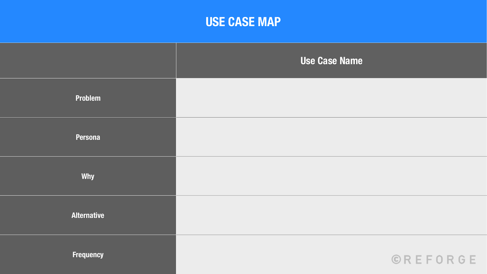
  
When it comes to changing metrics, Libby Weissman of Caviar recommends what she calls "running the play". The process is simple but effective;

- Get the metrics owners in a room. Those who will have this metric as their key focus.
- Pick a recent decision. Walk through the decision making process.
- Role play. Run through the same decision or another example, but now with the new metrics.
- Debrief on pros/cons. Is the change we're seeing aligned with our strategic goals.

## Analytics

__Task Overview__ [[ref](https://www.notion.so/Product-Intelligence-Task-2aa69c44c87d467aac975e2b8bf667ab)]
> We know that early engagement with our product is key to habit building and long term retention.
>
> We also know that the trial period is where users decide on how they’ll fit Blinkist into their lives and engagement during trial is indicative of early engagement post-purchase.
>
> Therefore, we want to identify how we can change the trial experience to increase the proportion of star customers in month one.
>
> __Please suggest a change to the trial experience that is likely to improve the proportion of star subscribers or as a proxy simply repeat engagement on multiple distinct days in month one.__
>
> The suggestion can be an addition of a new product feature, an improvement to an existing one, or removal/simplification of a feature, changes to the content we surface, etc.

If I'm interpreting the data correctly, the dataset only contains people who did subscribe (everyone has a `trail_retention_at`). This is not ideal, as we would really like to compare those that did retain versus those that did not and see what are the main differences in behaviour.

### TLDR

There are two significant differences between those that are active 5 days or more in their first 28 days after signing up versus those who are not.

(1) How they engage with the content. Those who are more active spend more time per book. This suggests depth versus breadth is important. Spending less than 4 and a half minutes per book is particularly indicative of being less active.

Suggestions;

- Add social queues to let people know they are moving through the book faster than most
- Suggest the next most popular group in the same category when someone is 50% through their existing book

It seems odd that people's behaviour of how they use the product does not change dramatically over time.

Suggestions;

- Encourage more exploration of the product early on by
  - (1) extending the trial period to 28 days
  - (2) adding a longer onboarding process, highlighting and drip feeding features throughout the 28 days
  - (3) add badges and achievements to encourage a habit being developed as well as more product features being used

(2) 35% of rows were missing `opend_from`, what I call a "surface". This might be suggestive of a bug in the product. Users whose most common surface was null was the biggest indicator that they would be less active in the first 28 days. This requires further investigation.

*Basic classification tree*

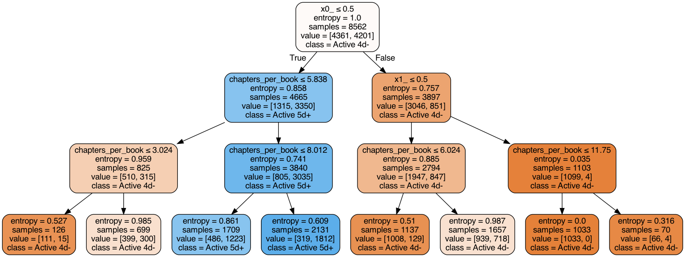

### An extended trial period

If the most important thing is getting people to use the product then the simplest thing to do would be to extend the trial period.

In the first 7 days after signing up, 21% of people were active for at least 5 days. In the first 28 days that number is 48%.

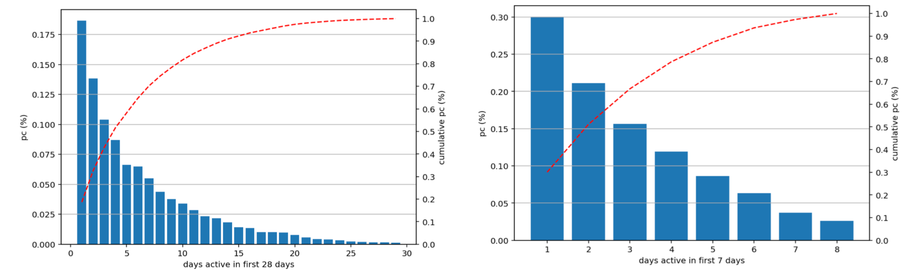

An extended trial period would also reduce uncertainty for people. There's currently a lot of asymmetry, giving people just one week to evaluate a purchase that lasts a year.

### Evolution of how people use the product

Interestingly there is not a significant difference in how people use the product in their first 28 days compared to the 28 days following purchasing an annual subscription.

Typically, consumer products have a extremely high engagement at first, which then levels off as people become more familiar with the product. Often products act on an explore versus exploit continuum; at first people explore the product, seeing everything it has to offer before forming a habit and using the product in a more specific manner.

There is some evidence of this, with users spending fewer minutes per book and in the app generally, reading fewer chapters and books, and accessing content from fewer surfaces, in the 28 days following trial retention versus 28 days after signing up.

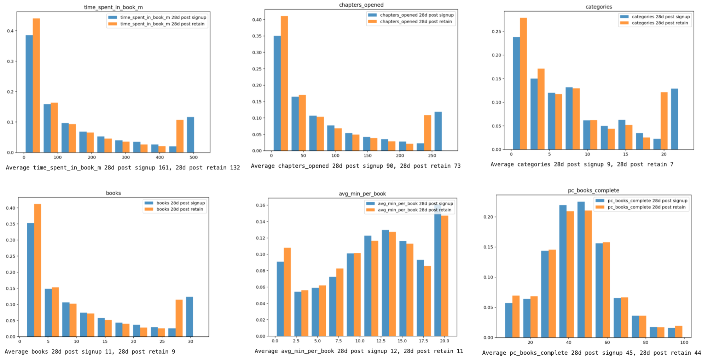

*note: some data winsorized to account for long tail*

The difference between the first 28 days and 28 days following retention is not significant. This suggests a number of possibilities:

- The product is intuitive and easy to use from day one
- People sign-up to the product with high intent and continue to find content on the app
- People are under utilising elements of the product

Two product suggestions with a view to increasing engagement in the trial period:

**(1) Guided exploration**: Review the onboarding flow. Drip feed hints and features available in the product once a user has completed certain tasks. For example, once someone has read a Blink, highlight the "explore" button and guide people through the process of building a library. This is similar to game design, where hints and tips of available features are provided once people have moved through certain "gates".

**(2) Provide an endorphin hit**: Badges and achievements could be introduced, these both provide guidance on all the features available in the product and secondly they provide an endorphin hit and incentive for people to build a habit.

### What behaviour separates those who are active 5 days or more in their first 28 days?

48% of the people were active at least 5 days in their first 28 days. This gives a well balanced data set to compare what separates those active at least 5 days versus those that were not.

We want to only use comparable statistics, those that are not affected by the number of days active, such as percentage of a books completed, or average minutes per book and per day.

The key seems to be in content, finding that "killer" book that really engrosses the user and encapsulates a particular category. Those active more than 5 days don't seem to look for more books per category, therefore breadth is preferred to depth.

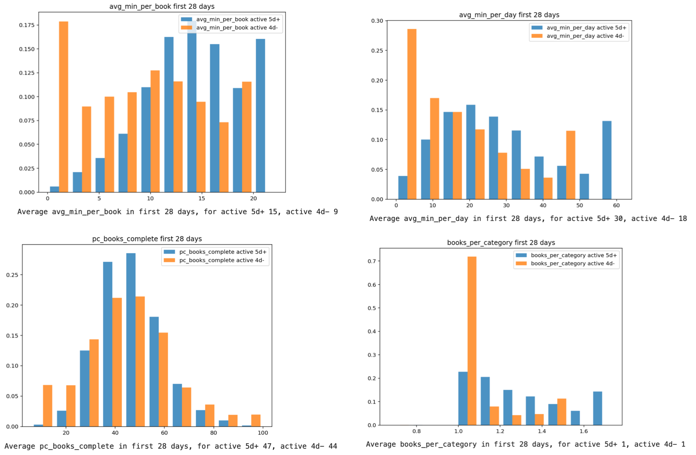

The group of users who are active 4 days or less in their first 28 days have a much broader range of tests.

The most popular book in both categories was `The 7 Habits of Highly Effective People`. However, how people engage with the book is quite different.

| - | Active 5 days+  | Active 4 days-  |
|---|---|---|---|---|
| % of group opened the book  | 12.5 | 4.3 |
| avg % of book complete  | 36 | 38 |
| avg mins per person | 27 | 18 |

This suggests if someone is moving through a book extremely quickly, we should either (1) prompt them to explore a new book (*ideally the next best in the same category*), or (2) let them know they are moving quickly ("*people who best recall this chapter spend x minutes, you spent y minutes, do you want to re-read?*")

We see similar behaviour in a number of books popular in both groups

| Title | - | Active 5 days+  | Active 4 days-  |
|---|---|---|---|---|
|Living Forward| % of group opened the book  | 10 | 3 |
|Living Forward| avg % of book complete  | 43 | 43 |
|Living Forward| avg mins per person | 19 | 11 |
| -- | -- | -- | -- |
|13 Things Mentally Strong People Don't Do| % of group opened the book  | 9 | 4 |
|13 Things Mentally Strong People Don't Do| avg % of book complete  | 34 | 36 |
|13 Things Mentally Strong People Don't Do| avg mins per person | 28 | 18 |

Generally, there isn't a huge difference in which books are most popular, but the less active group has a much wider taste. Suggesting the amount of content available is not the most impact factor, but really finding a book people will engage with.

****

People that sign-up for Blinkist display a broad range of interests. However, people seem to be looking for the canonical book that encapsulates that category;

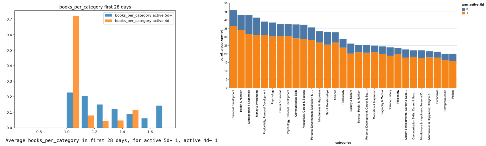

Blinkist does have learning paths, but it might be simpler to take books and combine them. We could take the most popular chapters from the most popular books and from some our team regard as "hidden gems" and combine them into a category Blink.

Creating a `popularity rank` score, which is simply `minutes per person` * `pc of people opening the book` shows that both groups have fairly similar tastes.

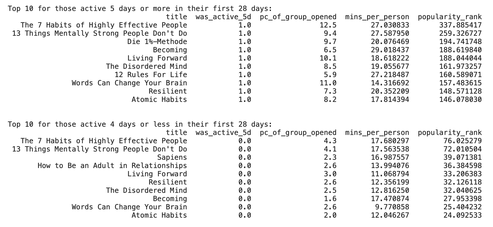

Using a method similar to this or slightly less self-referential we can create a "top book per category". If someone is passing through a book quickly, then we could refer the next most popular book.

For example:

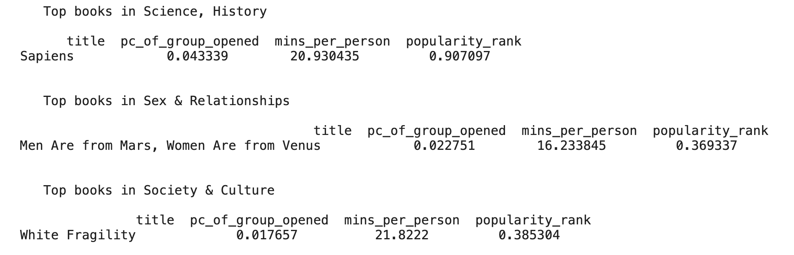

### Variables that separate those active 5 days or more in the first 28 days

Eyeballing the data, nothing obvious appears to me when looking at the categories. There isn't a "killer" category. However, further investigation could be done to provide a proxy for quality. If certain categories perform less well we could re-review the existing material to ensure it is up-to-par.

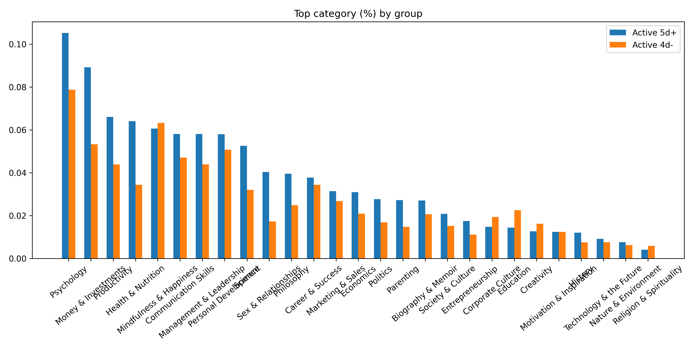

33% of rows were missing `opened_from`, it appears this tracking might be linked to a bug in the product and should be investigated

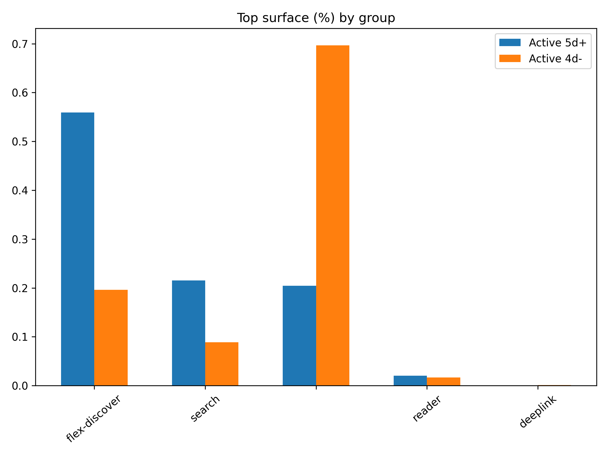
