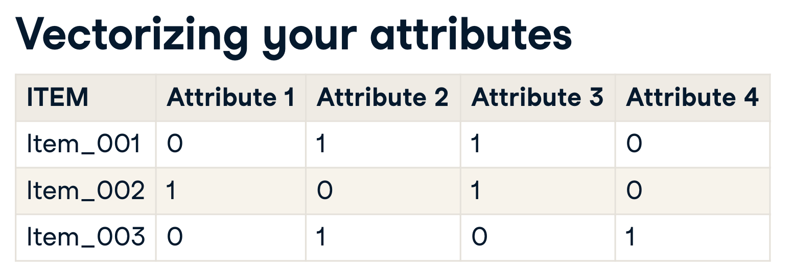
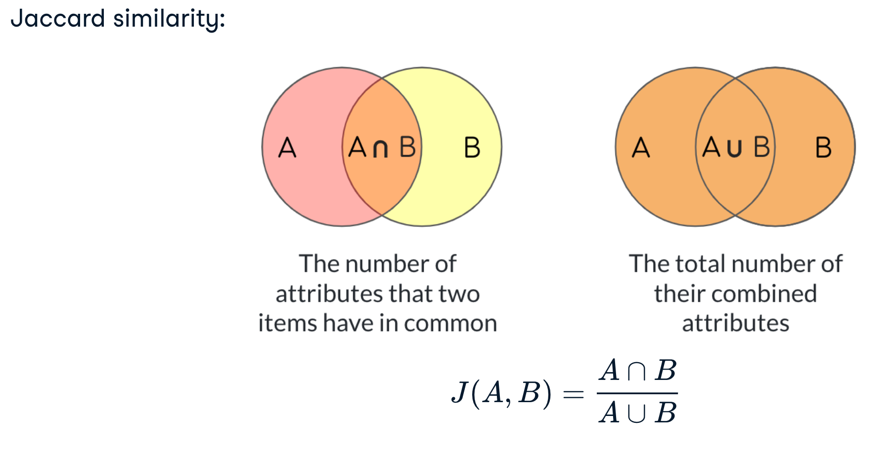
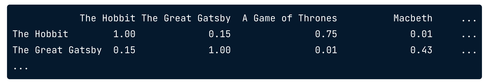

# Building recommendation systems

Notes from [Datacamp's course](https://learn.datacamp.com/courses/building-recommendation-engines-in-python), [Eugene Yan's blog](https://eugeneyan.com/tag/recsys/) and elsewhere.

Recommendation engines use the feedback of users to find new relevant items for them or other users, with the assumption that users who have similar preferences in the past are likely to have similar preferences in the futures.

> Recommendation engines target a specific kind of machine learning problem, they are designed to suggest a product, service, or entity to a user based on other users, and their own feedback. 

There is a many-to-many relationship between the items being recommended and the users. Users interact with many items. Each item is interacted with by many users.

- a better recommendation can be made for an item that has been given a lot of feedback
- more personalised recommendations can be given for a user that has given a lot of feedback (signal/interactions)

How a user's preferences are measured falls into two main groups; (1) implicit feedback and (2) explicit feedback;


## Non-personalised recommendations

Recommending items most commonly paired.

For example, if a user rates "The Great Gatsby" 5 stars, recommend the `most read` books of other users who also rated it 5 stars.

Alternatively, create a ranking system for books, for example `average rating`, or `average rating * customers read` or set a threshold in terms of popularity (read by x number); and provide the highest ranked books as recommendations.

```Python
# recommend what's most popular

# take the 50 most popular
movie_popularity = user_ratings_df["title"].value_counts()
popular_movies = movie_popularity[movie_popularity > 50].index
popular_movies_rankings =  user_ratings_df[user_ratings_df["title"].isin(popular_movies)]

# sort by their average rating
average_rating_df = popular_movies_rankings[["title", "rating"]].groupby('title').mean()
sorted_average_ratings = average_rating_df.sort_values(by="rating", ascending=False)
```

You can create pairs of items, the item most commonly seen with A. _Note_ we want both permutations, i.e. order matters;


```Python
import pandas as pd
from itertools import permutations
from typing import List

def create_pairs(x: List[str]) -> pd.DataFrame:
    pairs = pd.DataFrame(list(permutations(x.values, 2)),
        columns=["book_a", "book_b"]
        )

    return pairs

book_pairs = book_df.groupby("user_id")["book_title"].apply(create_pairs).reset_index(drop=True)
pair_counts = book_pairs.groupby(["book_a", "book_b"]).size()
pair_counts_df = pd.to_frame(name="size").reset_index()
pair_counts_df.sort_values(by="size", ascending=False, inplace=True)

# most common books after someone has read LotR
pair_counts_df[pair_counts_df.book_a == "Lord of the Rings"].head()
```

## Content based recommendations

Recommending items similar to items a user has liked in the past. We need a notion of similarity between items.

Content based recommendations, prioritises items with similar attributes. This allows you to recommend new items, as well as leveraging a long-tail of items.

Encode attributes as a vector to easily calculate distance and similarity between items;



```Python
"""
# convert
|| title || genre ||
| book a | genre a |
| book a | genre b |
| book b | genre a |
| book b | genre c |

# to 
|| title || genre a || genre b || genre c ||
| book a |      1   |  1       |     0    |
| book b |      1   |  0       |     0    |
"""

df = pd.crosstab(df_books.title, df_books.genre).reset_index()

df[df.index == "Lord of the Rings"]
```

### Calculating similarity

The `Jaccard Similarity` is the ratio of attributes two items have in common / by the total number of combined attributes

$\cap$ = intersection (overlap) between two arrays

$\cup$ = union (all elements) in two arrays



```Python
# similarity between two items
from sklearn.metrics import jaccard_score

print(jaccard_score(
    np.asarray(df_book.loc["The Hobbit"].values), 
    np.asarray(df_book.loc["A Game of Thrones"].values)
))

# similarity between all items at once
from scipy.spatial_distance import pdist, squareform

#  pdist == pairwise distance
jaccard_distances = pdist(df_books.values, metric="jaccard")

# turns 1d array into nested-array
# subtract values from 1 as jaccard is a measure of difference
sq_jaccard_distances = 1 - squareform(jaccard_distances)

distance_df = pd.DataFrame(sq_jaccard_distances,
                            index=df_books.index,
                            columns=df_books.index)


def similarity(title1: str, title2: str, df: pd.DataFrame) -> int:
    """returns the similarity score of two books"""
    return df[title1][title2]
```

Resulting dataframe;



`Cosine Similarity`
