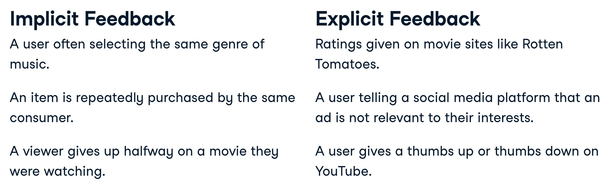
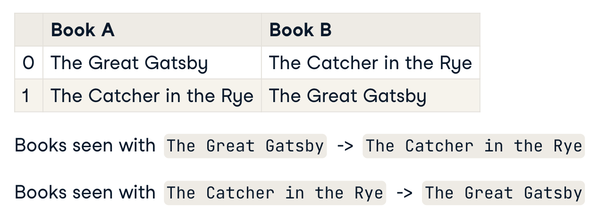

# Building recommendation systems

Notes from [Datacamp's course](https://learn.datacamp.com/courses/building-recommendation-engines-in-python), [Eugene Yan's blog](https://eugeneyan.com/tag/recsys/) and elsewhere.

Recommendation engines use the feedback of users to find new relevant items for them or other users, with the assumption that users who have similar preferences in the past are likely to have similar preferences in the futures.

> Recommendation engines target a specific kind of machine learning problem, they are designed to suggest a product, service, or entity to a user based on other users, and their own feedback. 

There is a many-to-many relationship between the items being recommended and the users. Users interact with many items. Each item is interacted with by many users.

- a better recommendation can be made for an item that has been given a lot of feedback
- more personalised recommendations can be given for a user that has given a lot of feedback (signal/interactions)

How a user's preferences are measured falls into two main groups; (1) implicit feedback and (2) explicit feedback;



## Non-personalised recommendations

Recommending items most commonly paired.

For example, if a user rates "The Great Gatsby" 5 stars, recommend the `most read` books of other users who also rated it 5 stars.

Alternatively, create a ranking system for books, for example `average rating`, or `average rating * customers read` or set a threshold in terms of popularity (read by x number); and provide the highest ranked books as recommendations.

```Python
# recommend what's most popular

# take the 50 most popular
movie_popularity = user_ratings_df["title"].value_counts()
popular_movies = movie_popularity[movie_popularity > 50].index
popular_movies_rankings =  user_ratings_df[user_ratings_df["title"].isin(popular_movies)]

# sort by their average rating
average_rating_df = popular_movies_rankings[["title", "rating"]].groupby('title').mean()
sorted_average_ratings = average_rating_df.sort_values(by="rating", ascending=False)
```

You can create pairs of items, the item most commonly seen with A. _Note_ we want both permutations, i.e. order matters;




```Python
import pandas as pd
from itertools import permutations
from typing import List

def create_pairs(x: List[str]) -> pd.DataFrame:
    pairs = pd.DataFrame(list(permutations(x.values, 2)),
        columns=["book_a", "book_b"]
        )

    return pairs

book_pairs = book_df.groupby("user_id")["book_title"].apply(create_pairs).reset_index(drop=True)
pair_counts = book_pairs.groupby(["book_a", "book_b"]).size()
pair_counts_df = pd.to_frame(name="size").reset_index()
pair_counts_df.sort_values(by="size", ascending=False, inplace=True)

# most common books after someone has read LotR
pair_counts_df[pair_counts_df.book_a == "Lord of the Rings"].head()
```
