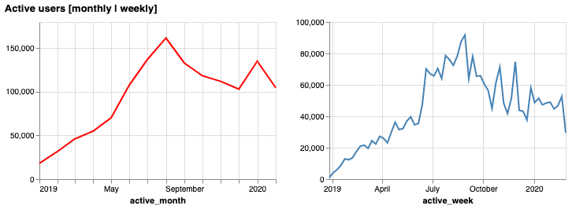

# Improving consumer retention at Cleo

Retention has been dupped "[_the silent killer_](https://www.reforge.com/blog/retention-engagement-growth-silent-killer)", it is the [bedrock of strong growth](https://www.reforge.com/blog/growth-metric-acquisition-monetization-virality).

The report;

* Defines retention
* Provides a view of performance to date
* Looks at they key metrics and behaviours influencing retention
* Provides a set of recommendations for improving retention

## TLDR

**Metrics** - there seems to be a trade-off between product adoption (subscription and auto-save in particular) and app usage over the long-term (6 months).

The key metric I would like us to focus on is bringing these two into alignment. What changes can be make to auto-save and the subscription offering that ensure people continue to use the app.

**Recommendations and thinking beyond the data**

* Those acquired through Influencers retain less well over 1 month, but better over 6 months. This suggests that content and having a companion is important in continuing to invest in your financial health. I recommend we invest more in product marketing and content production.
* Targeted advertising (for example overdraft ads) works more effectively than general advertising. I recommend the marketing team to focus on understanding the problems our customers face.
* Products such as auto-save and subscription seem to have a negative link with long-term retention. Perhaps the product "over promises and under delivers", perhaps people want to be "more in control" and they don't want to relinquish control of their finances but rather seek guidance (and is why budgeting performs better). I recommend we conduct user research to better understand "the job to be done" and the emotions involved in understanding how people want to get better with money.
* The device or product surface is not material in retention. Though those on messenger and acquired through an influencer to retain. I recommend we continue to invest in "meeting the user where they are", making Cleo as available as possible.

## Defining retention

Retention = (activation, engagement, resurrection)

* Activation is the point at which a user is created (completes the sign-up flow)
* Engagement is defined as whether the user opens the app
  * future analysis should be performed to understand how people engage with the app. Introducing a user behaviour data collection system such as Snowplow will provide us with this rich data
* Resurrection, these are users that have not used the app for a certain period

The analysis looks at the data on both a weekly and monthly view. However, the product team must decide which is a better indicator of the value users are deriving the product.

The data & product teams must agree on clear definitions for terms such as activation and engagement.

## What does the world look like today?

__Note: The dataset contains only users that signed up to Cleo between January 2019 to August 2019. The dataset contains the activity of these users up until February 2020__. Please note, the limitations of the dataset. The result will mean some basic growth accounting graphs will appear "off". It does not prevent us performing the analysis but something to keep in mind throughout.

**Activation** - Cleo has continuously been able to attract new users to the product throughout the year. This was particularly true in June. However, much of this would have been as a result of the extra press coverage we received when we raised our latest funding round (everyone loves a winner).

**Engagement** - Following that large spike in new users, we've seen much more noise in active users, suggesting many of these users did find value in the product.

Note, this only contains users signed up between Jan-Aug'19, so is not "total active users"

This is better understood through a simple growth accounting chart;

The spike in churn in February should be cause for concern and requires a retrospective to be performed, did we can a bug in the product or downtime?

Viewing retention this way can be misleading. Though our ability to retain customers on a monthly basis is strong, viewing as cohorts provides perhaps a more useful lens.

The spike seen at the same point for many cohorts is June 2019, i.e. they returned to the product following the news coverage of our fund raise.

Retention tapers off at around 40-50%. By industry standards, this is not bad. However, customer acquisition in FinTech is notoriously high, so anything we can do to improve retention is improve both our unit economics and growth.

## Product uptake

Customers retain because they find value in the product. This may seem trivial, but it's important to understand, because in order to find "product market fit", we must understand "The Job To Be Done", the thing people are using our product for.

We want to push people to find this value, in order to retain them.

Segmenting customers on demographic data (age for instance) can be useful, though used with caution, because really we're trying to find the "JTBD".

We currently have three main offerings for customers, budgeting, auto-save and a subscription bundle.

Budgeting is the most popular product. I assume one reason for this is it has been around the longest. Additionally, we other two products have a much "longer tail", i.e. they are adopted slower.

Products tend to be adopted shortly after a customer signs-ups. However, this is particularly true for budgeting.

 

However, interestingly, there is little overlap between the products.

My inclination would be to;

(1) prioritise features relating to the budget product

(2) review the subscription offering, are there additional budgeting features we could include

(3) both budgeting and saving may seem as a similar "job to be done" but perhaps the "auto" nature of the saving product is the difference. My hypothesis is that people want to feel in control, they want guidance, they want feedback, but they don't want Cleo to do it on their behalf. An A|B test where the auto-save feature is turned to a suggestion (i.e. prompting the user to save, could prove this out)

## What separates those who retain versus those who do not?

In this section we review how product selection impacts retention, as well as using information about the user (age, device and acquisition channel).

First, lets build an understanding of the small number of features we have to work with;

* Our users skew young
* Over 50% were acquired via influencers, and nearly 25% through ads relating to overdrafts
* The majority of our users are US based
* ~15% of users access Cleo through an Android device
  * I assume these devices are first attribution (i.e. the channel through which customers signed up as they are not mutually exclusive)

Age may be a collider in other factors. i.e. Device and acquisition source may be a reflection of age, (are younger users are more likely to be acquired via influencers and use messenger?). 

We should not let this perturb us from continuously exploring new acquisition channels. But be aware these features are not independent.

### 30 day and 180 day retention

In this case we're using a crude definition of "retained". We're looking at users that made any interaction after 30 and 180 days from signing up.

Base case:

* 86% of users used the produce at least once 30 days after signing up
* 61% of users used the produce at least once 180 days after signing up
* future analysis should better define "engaged" users

If we look at each feature on an individual basis and normalise (to account for the skewness, i.e. influencer is the dominant acquisition source so we need to adjust the data to treat of acquisition sources equally).

|Feature|Value|30 day (%)|180 day (%)|
|---|---|:---:|:---:|
|Product|Subscription|98   |22   |
|Product|Auto-save|98   |20   |
|Product|Budget|91   |33   |
| |  |  | |
|Acquisition Source|FB ads general| 93  |24   |
|Acquisition Source|FB ads overdraft|90   |30   |
|Acquisition Source|Influencer|82   |48   |
|Acquisition Source|Friend Referral|87   |31   |
| |  |  | |
|Device|iOS|86   |42   |
|Device|Messenger|86   |35   |
|Device|Android|84   |42   |
| |  |  | |
|Country|US|85   |28   |
|Country|UK|89   |40   |

_Age has not been added, normalised figures show little impact (until you fairly old), but it is also assumed that age may be a collider, a "hidden variable" behind others._ - I should measure the co-linearity to check.

#### Interpreting the results

**(1)** Interestingly, the _Influencer_ channel seems to retain less well in the short-run but better in the long-run. 

* Hypothesis is that people need a continual nudge, or a "companion" to continuously remind and support them of the value in investing in their financial literacy.
* Implication; could Cleo create more content with product marketing, for instance "here are five tips to better save $100 a month". _That sort of thing_.

**(2)** It could be perceived that the "auto-save" product is actually a negative experience for customers.

* Both subscription and auto-save are very good at attracting customers at first, but fail to keep them long-term (this in turn will reduce their LTV)

**(3)** Focused adds work better and attract customers that are more likely to retain

* Cleo is still in its infancy and "branding" or "general" advertising would appear to be less valuable at this time, but it's hard to say for sure.

#### Reviewing multiple variables

As we assume significant co-linearity between features we'll run a basic decision tree to cluster users into homogeneous groups (i.e. our objective function is to minimise entropy).

Looking at 30 day retention the model is not very insightful as such a large proportion of users retain. As highlighted in the table above, there is a strong correlation with product adoption and 30 day retention, though it also appears that those acquired through an influencer have stronger ties to adopting products.

  

Looking at 180 day retention we see the influencer acquisition channel is not the most important variable. Again, we're not looking for a prediction here, but looking to understand, based on the customers today, what separates them. Interestingly, out of the products, subscription is the most negative in terms of 180 day retention.

  

****
