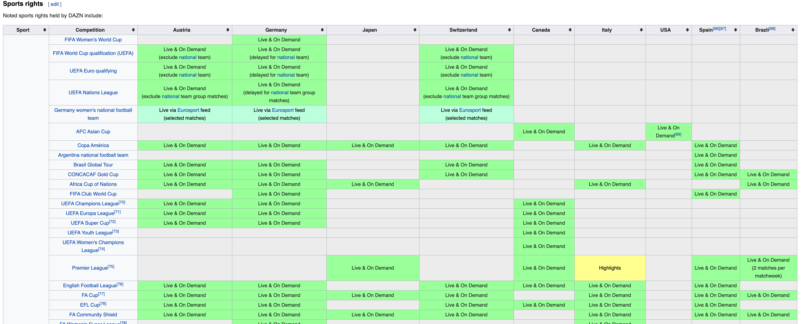
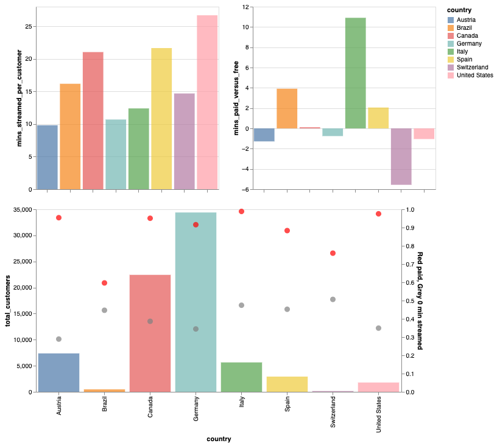
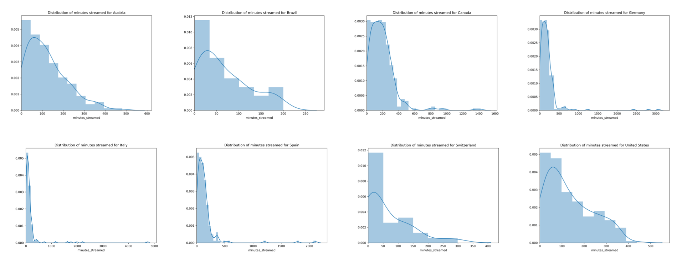
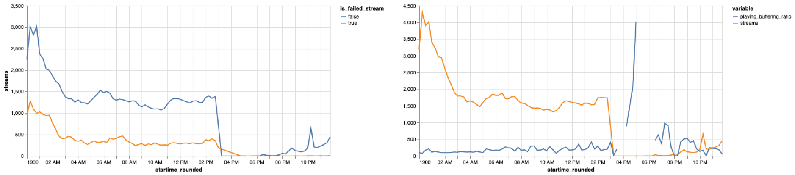

# DAZN Product Manager Task

## Notes on the dataset

50,000 duplicate rows were removed from `customer_details` during the data wrangling process. Details of which can be found in the accompanying iPython notebook.

All time stamps are provided in UTC. _Thank you_

When `startup_time` is Null this is considered a “failed stream”. Null values have been filled with 0 and a new boolean column created `is_failed_stream`. It’s not clear if this is a platform error (DAZN) or the customer didn’t have the rights/access to view the stream.

## SQL Questions

“Streaming time” could be considered “playing time” + “buffering time”. However, I have assumed it to be equivalent to only “playing time” as it represents a customer actually viewing content, rather than showing intent.

__Which country streams the most?__ Write a query that returns only one row with the country name and the total streaming hours.

```SQL
SELECT
	country
	, ROUND(SUM(playing_time) / (1000 * 60 * 60)) total_hours_streamed
FROM streaming_details
JOIN customer_details USING(customer_id)
GROUP BY 1
ORDER BY 2 DESC
LIMIT 1
```

| country | total_hours_streamed |
|---|---|
| Canada | 7866 |

__Can you identify the user that streamed the most?__ Write a query that returns only one row with the user id and the total hours streamed.

```SQL
SELECT
	customer_id
	, ROUND(SUM(playing_time) / (1000 * 60 * 60)) hours_streamed
FROM streaming_details
JOIN customer_details USING(customer_id)
GROUP BY 1
ORDER BY 2 DESC
LIMIT 1
```

| customer_id | hours_streamed |
|---|---|
| 0011o00001bPTItAAO | 79 |

__How many Canadian paying customers have streamed more than 2 minutes?__

```SQL
WITH base AS (
  SELECT
      customer_id
      , SUM(playing_time) / (1000 * 60) minutes_streamed
  FROM streaming_details
  JOIN customer_details USING(customer_id)
  WHERE country = 'Canada'
  GROUP BY 1
)  

SELECT COUNT(DISTINCT customer_id) customers
FROM base
WHERE minutes_streamed > 2
```

| customers |
|---|---|
| 12218 |

__How many customers did not stream any content?__

```SQL
WITH base AS (
  SELECT
      customer_id
      , SUM(playing_time) playing_time
  FROM streaming_details
  JOIN customer_details USING(customer_id)
  GROUP BY 1
)  

SELECT COUNT(DISTINCT customer_id) customers
FROM base
WHERE playing_time = 0
```

| customers |
|---|---|
| 10650 |

__Identify the top 5 countries for engaged streams.__ A stream is considered engaged if the streaming time is greater than 2 minutes.

_note:_ taking total count of streams, rather than the proportion of total streams that are considered engaged.

```SQL
SELECT
    country
    , COUNT(*) AS engaged_streams
FROM streaming_details
JOIN customer_details USING(customer_id)
WHERE playing_time > 60000
GROUP BY 1
ORDER BY 2 DESC
LIMIT 5
```

| country | engaged_streams |
|---|---|
| Germany | 26679 |
| Canada | 16251 |
| Austria | 6942 |
| Italy | 2860 |
| Spain | 1619 |

## Business Questions

### In which country would you increase investment and why?

The market most suitable for increased investment would fit the following criteria; (1) the country already has compelling content available [content is king], (2) we are not near the market asymptote in terms of penetration.

Investment is not just dollars but time. Ideally, investment would be focused on customer acquisition, pouring fuel on the fire.

This automatically excludes `Moon` territories, which when viewed against DAZN's Wikipedia programming section makes sense:


<br>
<br>

__TLDR__:

- Canada, the US and Spain seem to have the most compelling content available.
- Using the DAZN data alone I would suggest the US, as the customer base is extremely small but very engaged, this seems like a good recipe for growth.
- However, external dynamics, such as Disney's push into streaming may make this either (1) the ideal time to invest as it's a land-grab opportunity to get users as they switch. Alternatively, (2) other markets, with less competition may offer a more "greenfield" / "blue ocean" strategy. In that case, Canada or Spain would be my next recommendations.

__Proxies for assessing the attractiveness of content (the inside view):__

- Customers in Canada, Spain and the US have streamed more than 20 minutes on average.
- In Brazil, Italy, Spain and a lesser extent Canada, paid subscribers stream more than free subscribers.
- ~90% or above of customers in Austria, Canada, Germany, Spain and the US are paying subscribers.

| country | total customers | pc of customers paying | pc streamed 0 min | mins streamed per customer | mins streamed paid versus free | pc engaged streams | distribution of those watching > 0 mins (kurtosis)
|---|---|---|---|---|---|---|---|
| Austria | 7373 | 95 | 29 | 9.8 | (1.3) | 47 | 0.85 |
| Brazil | 481 | 60 | 47 | 16.2 | 3.9 | 39 | (0.5) |
| Canada | 22433 | 95 | 39 | 21.0 | 0.1 | 41 | 16.88 |
| Germany | 34393 | 92 | 34 | 10.7 | (0.8) | 44 | 57.24 |
| Italy | 5644 | 99 | 47 | 12.4 | 10.9 | 28 | 63.21 |
| Spain | 2926 | 88 | 45 | 21.7 | 2.1 | 36 | 48.74 |
| Switzerland | 154 | 76 | 51 | 14.7 | (5.6) | 38 | 1.49 |
| US | 1790 | 98 | 35 | 26.7 | (1.1) | 43 | (0.56) |



Averages can be misleading. Looking at the distribution of hours viewed, excluding customers who have viewed 0 minutes:

- Austria, Brazil, Canada, Switzerland and the US appear to have the healthiest distributions.



_The kurtosis stats in the table are a measure of how extreme the tail is in the distributions above_

One factor to consider is that DAZN has not been in each country for an equal amount of time. Further analysis would take into consideration the rate of growth.

__Assessing the market (the outside view):__

Proxies for willingness to stream content:

- Youtube Traffic
- Netflix subscribers
- Is e-commerce penetration a proxy for consumers' willingness to stream content?
  - If so Italy would not be a great starting point.

Proxies for size of sports fan

- Sports fans (viewers) by sports available in the country
- Sport fans (attendance) by sports available in the country
- Incumbent
  - US: The Disney bundle includes Hulu, Disney+ and ESPN+ for $12.99/month. "200M sports fans"

### Can internet connection quality be the route cause of playback problems? If so, how would you solve them?

With only an [amateurish](https://www.cloudflare.com/learning/performance/what-is-streaming/) understanding of how streaming actually works. I would have assumed that concurrent streams (network congestion) would play a greater than connection quality in terms of performance, as CDNs and delivery infrastructure have elastic scaling. 'Connection quality' would effect `startup_time` whereas network congestion would effect `buffering_time`.

Rounding "start time" to the nearest 15 minute interval it appears this is somewhat true, i.e. the network has limited capacity. However, the playing to buffering ratio and proportion of failed streams seems fairly consistent when looking on a global basis.



_a stream is considered fail when `startup_time` is 0_

Running a simple linear regression model between `buffering_time` and `playing_time` per customers yields nothing interesting. If anything there is a positive correlation; suggesting people have no alternative to watch the event and are willing to endure a poor experience to some extent. _Further analysis would be required to understand the impact on retention_

If network capacity is indeed the most significant factor in performance, then we would want to incentivise people to join the stream in a more staggered fashion. Options would into one of two buckets:

Increase motivation

- invest in pre-production / original content to air before the game
- allow customers to choose between pre-game analysis and original content
- provide social proof (x% of your team's fan are watching the game, join them now!)
- provide the ability to have a live chat on the stream, creating a sense of community

Remove friction

- bucket customers into groups and send notifications at varying times with a link to the stream
- allow customers to add a link to their calendar which starts x minutes between the game

If the issue is believed is be on the client-side then the customer could receive a warning upon opening the app with "tips and tricks" to ensure their home wi-fi is set-up optimally.
