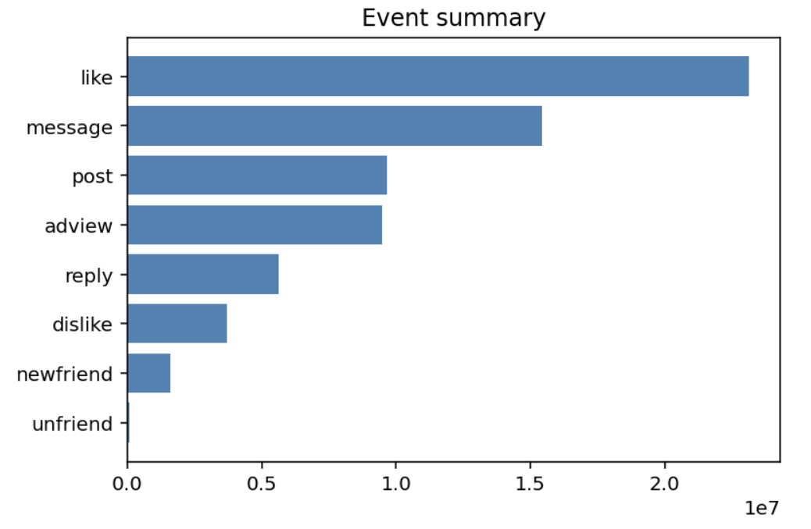
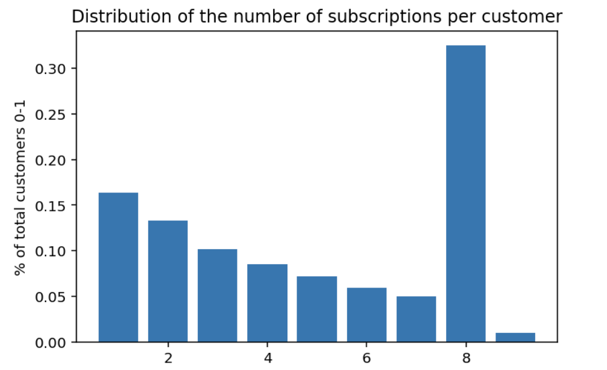
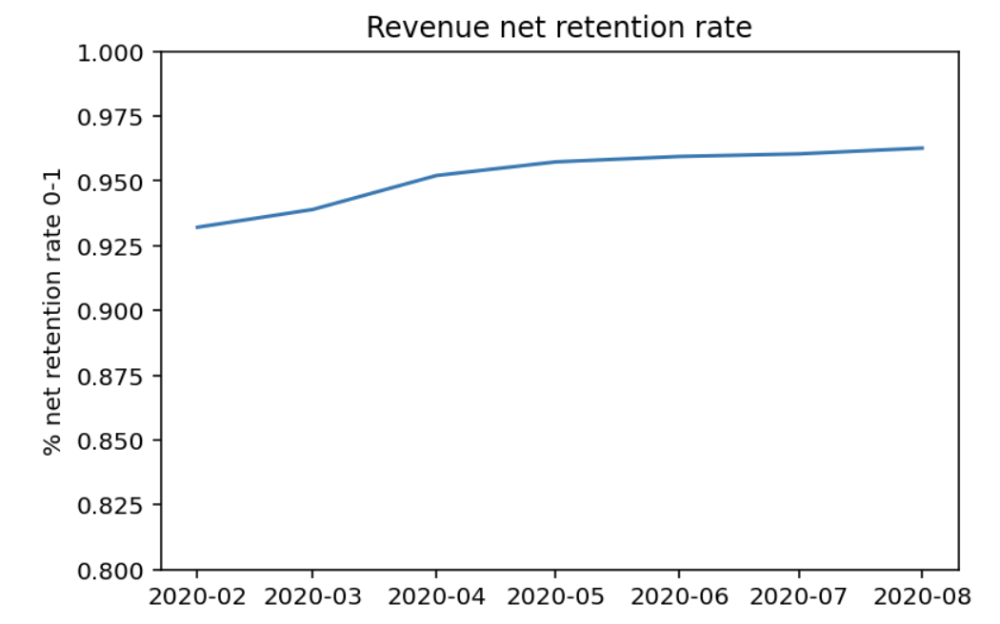

# Understanding the data

## Generate

Generate the data to a local postgres database.

The defaults for can altered in these two scripts.

```zsh
# create the schema and relevant table
>>> python data-generation/py/churndb.py

Creating schema socialnet7 (if not exists)...
Creating table event (if not exists)
Creating table subscription (if not exists)
Creating table event_type (if not exists)
Creating table metric (if not exists)
Creating table metric_name (if not exists)
Creating table active_period (if not exists)
Creating table observation (if not exists)
Creating table active_week (if not exists)
Creating table account (if not exists)

# simulate customer behaviour
# default 6 months, 10,000, 10% growth rate
>>> python data-generation/py/churnsim.py

Created 20000 initial customers with 135109 subscriptions for start date 2020-01-01
...
```

## EDA

We'll now have `event` data and `subscription` data.

All queries can be found in the `eda/queries` folder [[here](eda/queries)]



~16% of customers subscribed for a single month, ~32% of customers subscribed for 8 months;



There's no view of a "resurrected" user in the data. Equally, as dealing with a social network, upgrades and downgrades in subscriptions are not relevant.


