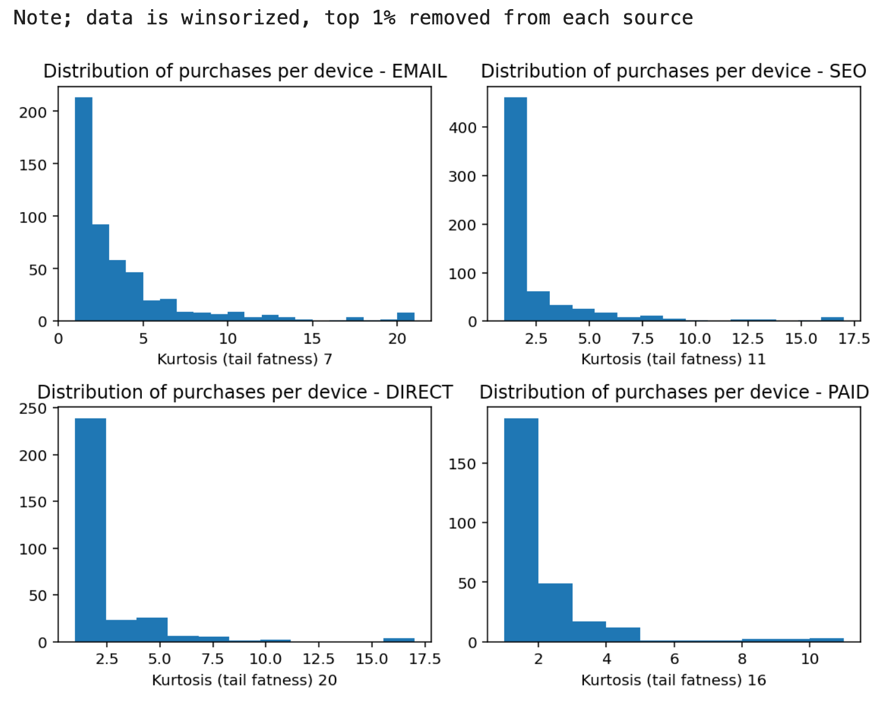
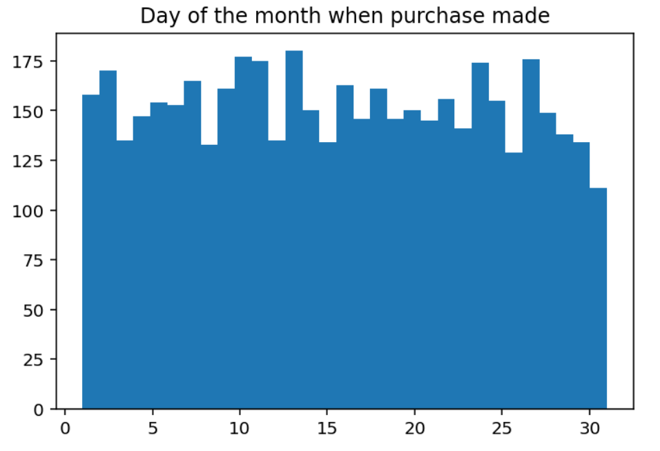

# Lyst Report

> Analyze the data set and offer any insights

Lyst is aiming to build a site that is to go to destination for fashion. Based on the data available I'll ask a number of questions to build an understanding of the business and product.

When it comes to shopping two distinct behaviours come to mind, (1) "I know what I want, I want to see if you have it in my size at a good price" and (2) "just looking, inspire me". The two behaviours will "co-exist", someone might browse often, continually looking at items until they are willing to purchase. Equally, someone could be wowed by an item and purchase it immediately.

It looks like most purchases made on Lyst are those made with an item already in mind. ~50% of purchases are made within 10 minutes of visiting the site;

This seems to be true generally, people come to Lyst with high intent, they seem to have a product already in mind. The chart below looks at the time from visiting to leaving to the retailer selling the product. If people are browsing, they are doing so for a short period.

This highlights the importance of the initial experience, whether it's features put together by Lyst's editors or recommendations based on the customer's history. Equally, it may highlight that Lyst is not quite fulfilling the "discovery / window shopping" experience, but is seen as a place people can go to find an item they already want. Further analysis would be required to make any concrete claims such as this.

Looking at the distribution of pages viewed per visit paints a similar picture, people come to Lyst with high intent.

----

The "traffic source" of visitors on the site can also tell us a bit more about how people are using the site.

If we aggregate by traffic source and normalise by the number of devices that made a purchase (using purchase as a proxy for person);

Looking at the aggregated numbers;

- We can see email has much higher repeat purchase rate than SEO
  - Intuitively, this makes sense, we could be letting the customer know we have found an item back in stock or giving recommendations based on their purchase history. Good news is once we build a relationship with the customer, we are able to serve them well
- Email also has a much higher conversion rate, 32% of devices coming from email made a purchase, compared to 14% for SEO
  - It would be good to break down both email and campaign by UTMs to understand this behaviour
- Customers are likely to use the site again once have made a purchase
  - This is less true for paid, where I assume Lyst has paid to rank for a particular item
- On average people buy more than one item at once and do two or three times a year, spend anywhere from £200 to £500. Can we hypothesise that people are using Lyst to purchase a small number of luxury goods a year, or "treat items"?

Averages and aggregated numbers can be misleading, so we'll break down categories to better understand behaviour.

From the image below, surprisingly email has the thinnest tail. Devices purchasing through email have a lower percentage of devices making a single purchase, but equally, they have a greater asymptote. Even removing the top 1%, email is less likely to drive a high number of purchases throughout the year. Trying to understand this, I think it makes sense as email is "push", whereas the other three traffic sources are "pull", the intent is generated by the user and we're trying to draw them in.

----

I had a hypothesis that because people are typically drop hundreds of pounds per order, purchases would be likely made at the end or start of the month, i.e. close to pay day.

It's clear that hypothesis is wrong. Customers are perhaps more price inelastic, or the average purchase price is being skewed by a number of expensive items. Therefore Lyst is able to offer high-street and high-end fashion.

----

Significantly more time could have been spent analysing the data. However, I want to give an indication of what is realistic in just two hours.

An example of questions I would have liked to investigate;

* Do they have lots of visits building up to a purchase?
* Do they browse through the week and then purchase on the weekend?
* What does the distribution of purchase value look like?
* What would the traffic source look like if we did first visit attribution? i.e. where do we first find customers - though per in mind the data represents a single year, we cannot assume every customer is new in 2017
* Construct a 454 calendar to create a view on seasonality

Due to the small number of features and in-balance in the dataset (small number of purchases) I was hesitant to run any regression or generalised linear models to try and determine what makes someone likely to purchase.
