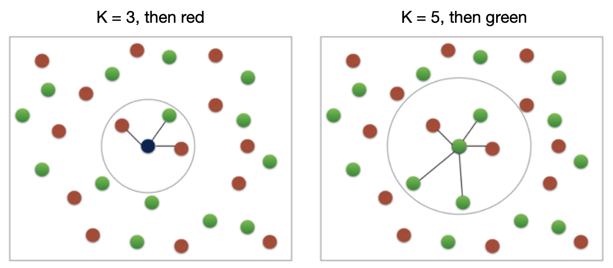
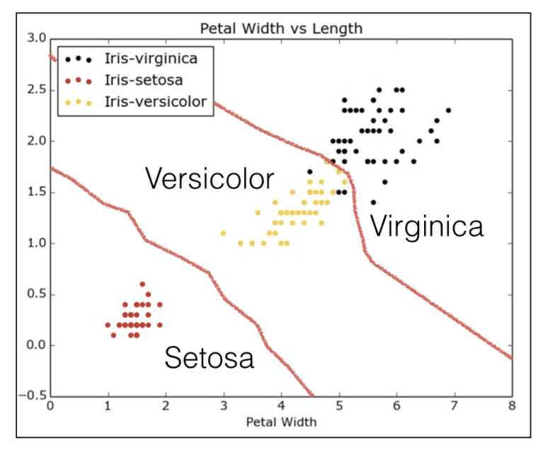
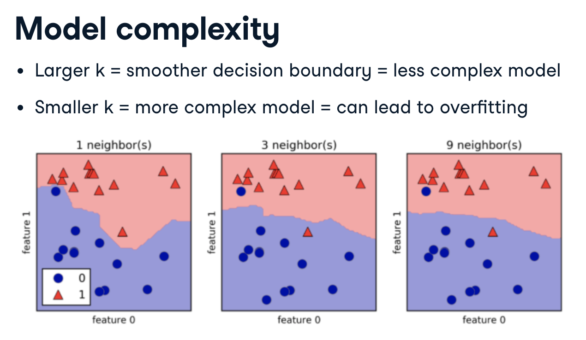
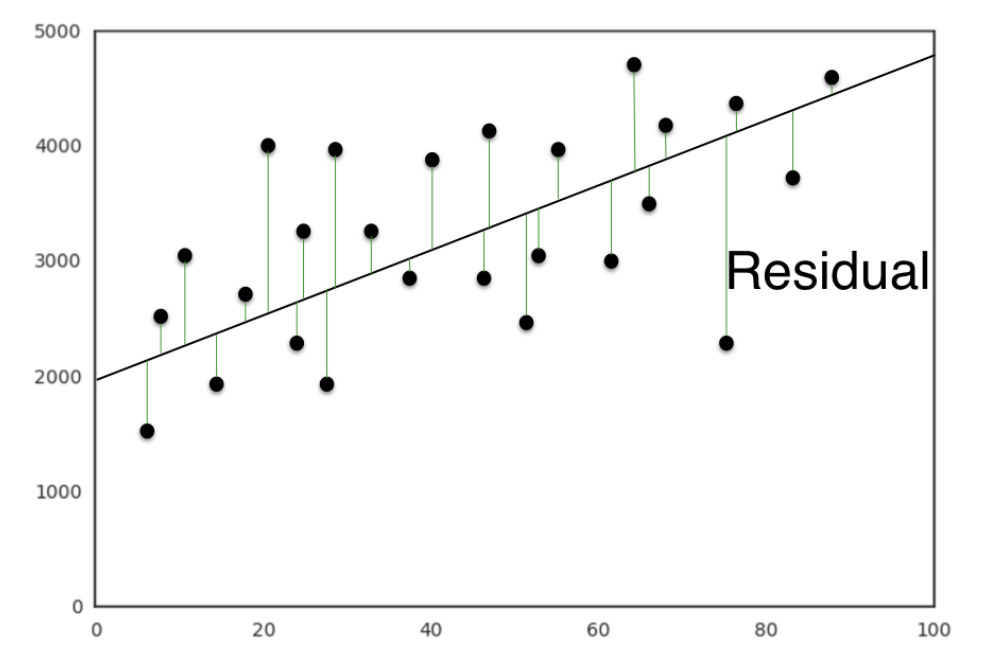
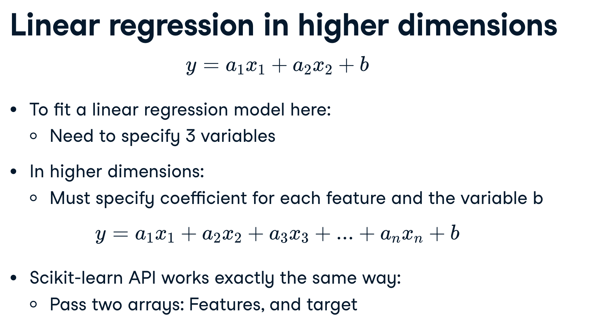
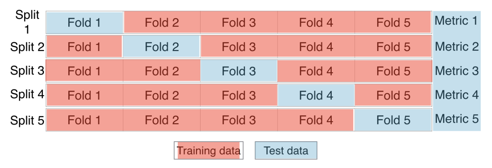
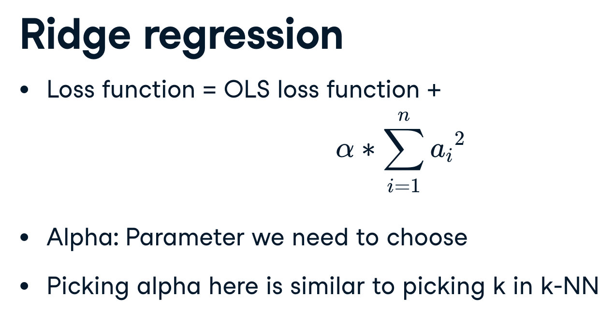
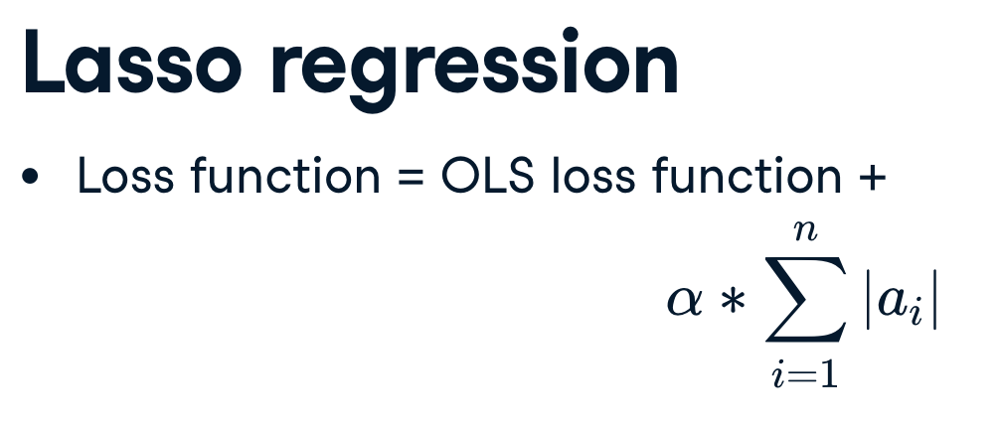

# Machine learning

Notes taken from a range of courses and compiled here. 

Courses includes:

- Supervised learning with `scikit learn` on [DataCamp](https://learn.datacamp.com/courses/supervised-learning-with-scikit-learn)

## What is machine learning

A programme can make a decision using data rather than being explicitly programmed. For example, is this email spam or not, or clustering wikipedia articles into categories.

When they are labels presents this is "supervised learning", i.e. spam or not spam. "Unsupervised learning" does not use labels. It is essentially the task of uncovering hidden patterns and structure from unlabelled data.

In "reinforcement learning" the software interacts with an environment. The agents then "figure out" how to optimise their behaviour given a system of rewards and punishments. Deep learning is a form of reinforcement learning.

## Supervised learning

We have `features` (predictor or independent variables) and `target` (response or dependent) variable.

We'll present the data in a table format, with each column representing a variable and each row an instance.

Predictor variables are either;

- discrete: they consist of categories or booleans, this is a classification task
- continuous: they consist of a continuous distribution of numbers, this is a regression task

### Classification: k-Nearest neighbours (KNN)

> The only things the algorithm requires are:
>
> - Some notion of distance
> - An assumption that points that are close to one another are similar
> 
> _Grus, Joel. Data Science from Scratch_

Classifying the blue point:

The algorithm is creating a set of "decision boundaries", this is intuitive when viewed in 2D:

As the boundary gets smoother, the model is less complex, less suspectible to "noise" and should be less overfitted. This typically means a higher `k`;

__Accuracy__ = correction predictions / total data points (using unseen data only!!)

### Regression

In regression tasks the target variable is a continuously varying variable, i.e. not `0` or `1` but rather a point on a curve, for example the price of a house, a country's GDP, or a bike share company using time and weather data to predict the number of bikes being rented at any given hour.

In linear regression we are trying to fit a line to the data. A line in two dimensions is always of the form; $y = ax + b$

- y = target
- x = feature
- a, b = parameters of the model

The concept of fitting becomes how do we choose the "best" $a$ and $b$

Typically we choose an "error function" for any given line, then choose the line that minimises that error function. Error functions can also be known as loss or cost functions.

A common error function in linear regression is to reduce the residual (the vertical distance between a line and all the points). We want to minimise the sum of the squared residuals (so that a positive and negative don't cancel each other out). This function is known as __OLS__, ordinary least squares.

> _Note:_ this is the same as minimizing the mean squared error of the predictions on the training set.

When calling `fit` on a linear regression model in scikit-learn, it performs this OLS under the hood.

Linear regressions uses R-squared to measure performance of the model, this metric quantifies the amount of variance in the target variable that is predicted from the feature variables.

Linear regression is very susceptible to outliers, therefore it isn't enough to split our test and training data. We need to run cross-validation.

We begin by splitting the dataset into $k$ groups or folds;

Then we hold out the first fold as a test set,

- we hold out the first fold as a test set, 
- fit our model on the remaining four folds
- predict on the test set, and compute the metric of interest

We do this process $k$ times, dependent on the number of folds we have. This is known as "k-fold cross validation".

The trade-off is using more folds is more computationally expensive.

__Regularisation__, if we have lots of features it becomes very easy to over-fit our model as the coefficients for each variable becomes larger. Therefore it want to alter the loss function, so that it penalises for large co-efficients, this is known as regularisation.

__Ridge regression__, is a type of regularised regression.

> our loss function is the standard OLS loss function plus the squared value of each coefficient multiplied by some constant alpha.

Alpha ($\alpha$, sometimes referred to as lambda $\lambda$) is a parameter we need to choose in order to fit and predict. Essentially, we can select the alpha for which our model performs best. Picking alpha for ridge regression is similar to picking k in KNN. This is called __hyperparameter tuning__. Alpha controls complexity of the model.

When alpha = 0, we are using standard OLS, as such large coefficients are not penalised.

Lasso regression__, is another type of regularised regression.

> our loss function is the standard OLS loss function plus the absolute value of each coefficient multiplied by some constant alpha.

Lasso regression can be used to select important features of a dataset. It shrinks the coefficient of less important features to be exactly 0.

> Lasso is great for feature selection, but when building regression models, Ridge regression should be your first choice.
> 
> Lasso performs regularisation by adding to the loss function a penalty term of the absolute value of each coefficient multiplied by some alpha. This is also known as $L1$ regularisation because the regularisation term is the $L1$ norm of the coefficients.
>
> If instead you took the sum of the squared values of the coefficients multiplied by some alpha - like in Ridge regression - you would be computing the $L2$ norm.

### Measuring model performance
