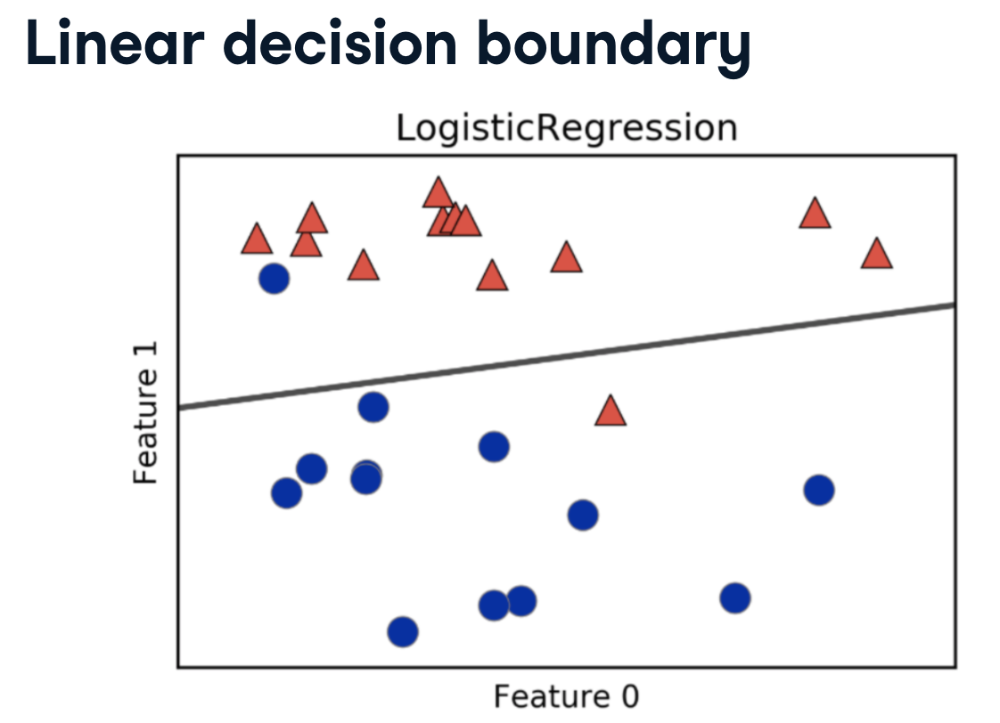
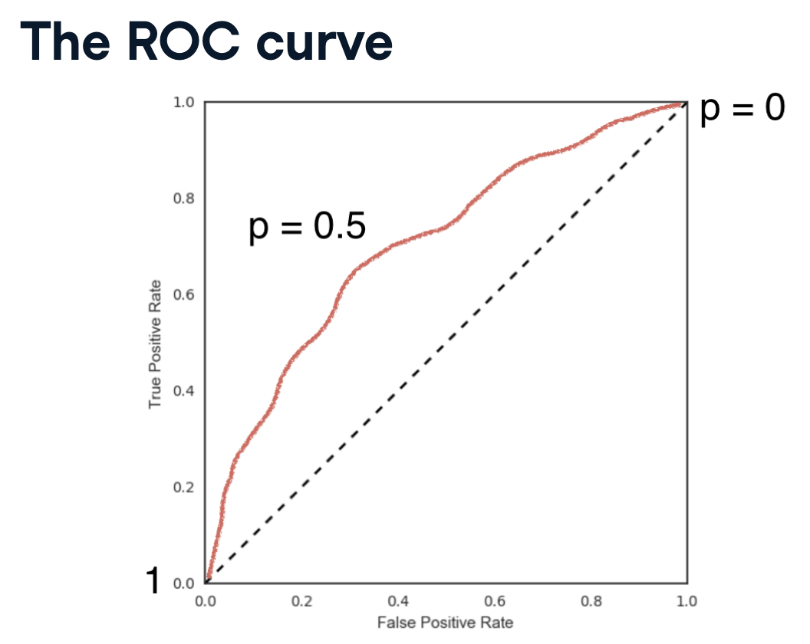
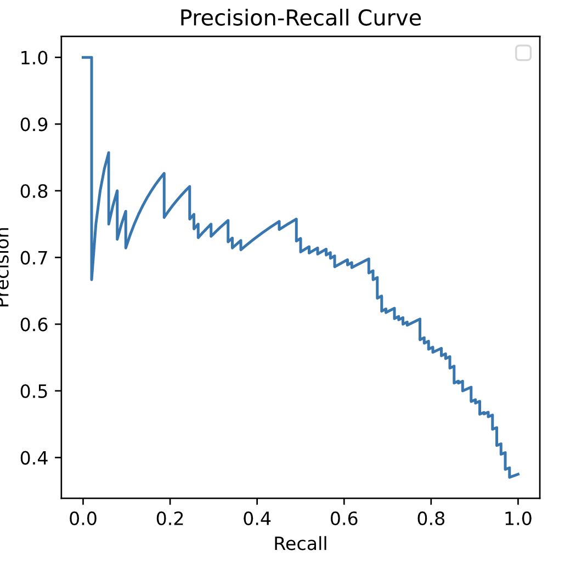
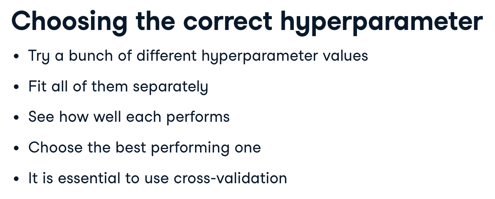
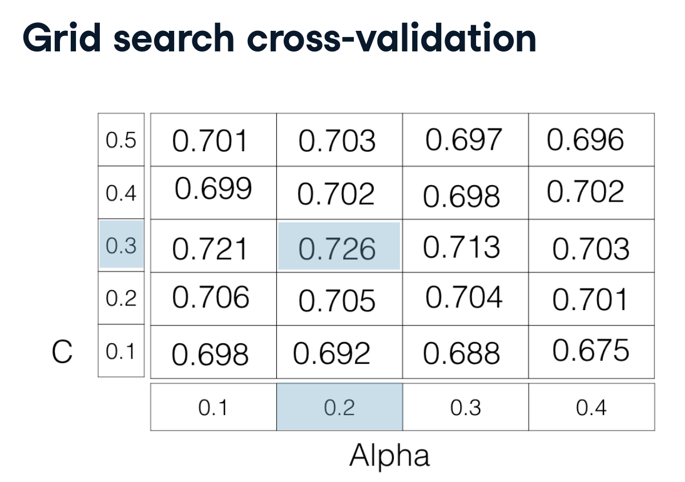
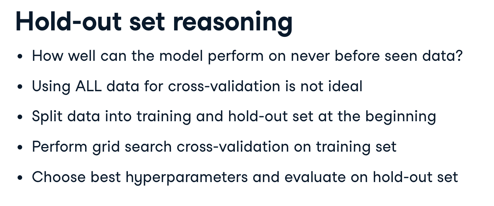
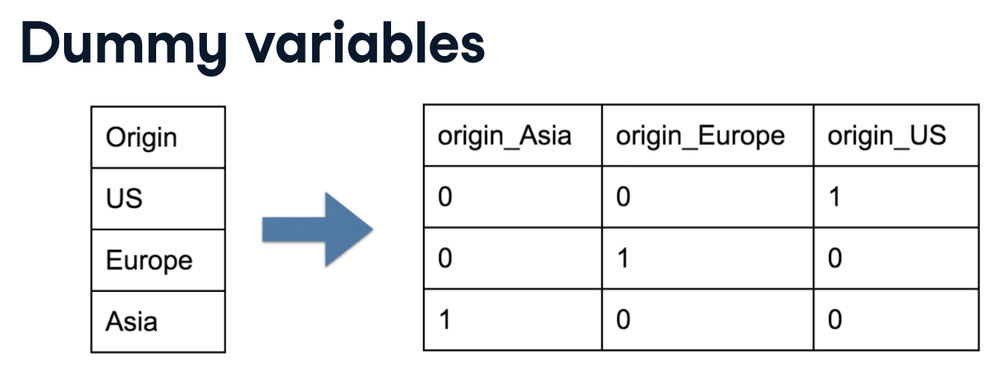

# Machine learning

Notes taken from a range of courses and compiled here. 

Courses includes:

- Supervised learning with `scikit learn` on [DataCamp](https://learn.datacamp.com/courses/supervised-learning-with-scikit-learn)

## What is machine learning

A programme can make a decision using data rather than being explicitly programmed. For example, is this email spam or not, or clustering wikipedia articles into categories.

When they are labels presents this is "supervised learning", i.e. spam or not spam. "Unsupervised learning" does not use labels. It is essentially the task of uncovering hidden patterns and structure from unlabelled data.

In "reinforcement learning" the software interacts with an environment. The agents then "figure out" how to optimise their behaviour given a system of rewards and punishments. Deep learning is a form of reinforcement learning.

## Supervised learning

We have `features` (predictor or independent variables) and `target` (response or dependent) variable.

We'll present the data in a table format, with each column representing a variable and each row an instance.

Predictor variables are either;

- discrete: they consist of categories or booleans, this is a classification task
- continuous: they consist of a continuous distribution of numbers, this is a regression task

### Classification: k-Nearest neighbours (KNN)

> The only things the algorithm requires are:
>
> - Some notion of distance
> - An assumption that points that are close to one another are similar
> 
> _Grus, Joel. Data Science from Scratch_

Classifying the blue point:


The algorithm is creating a set of "decision boundaries", this is intuitive when viewed in 2D:


As the boundary gets smoother, the model is less complex, less suspectible to "noise" and should be less overfitted. This typically means a higher `k`;


__Accuracy__ = correction predictions / total data points (using unseen data only!!)

### Linear Regression

In regression tasks the target variable is a continuously varying variable, i.e. not `0` or `1` but rather a point on a curve, for example the price of a house, a country's GDP, or a bike share company using time and weather data to predict the number of bikes being rented at any given hour.

In linear regression we are trying to fit a line to the data. A line in two dimensions is always of the form; $y = ax + b$

- y = target
- x = feature
- a, b = parameters of the model

The concept of fitting becomes how do we choose the "best" $a$ and $b$

Typically we choose an "error function" for any given line, then choose the line that minimises that error function. Error functions can also be known as loss or cost functions.

A common error function in linear regression is to reduce the residual (the vertical distance between a line and all the points). We want to minimise the sum of the squared residuals (so that a positive and negative don't cancel each other out). This function is known as __OLS__, ordinary least squares.

> _Note:_ this is the same as minimizing the mean squared error of the predictions on the training set.


When calling `fit` on a linear regression model in scikit-learn, it performs this OLS under the hood.


Linear regressions uses R-squared to measure performance of the model, this metric quantifies the amount of variance in the target variable that is predicted from the feature variables.

Linear regression is very susceptible to outliers, therefore it isn't enough to split our test and training data. We need to run cross-validation.

We begin by splitting the dataset into $k$ groups or folds;

Then we hold out the first fold as a test set,

- we hold out the first fold as a test set, 
- fit our model on the remaining four folds
- predict on the test set, and compute the metric of interest

We do this process $k$ times, dependent on the number of folds we have. This is known as "k-fold cross validation".


The trade-off is using more folds is more computationally expensive.

__Regularisation__, if we have lots of features it becomes very easy to over-fit our model as the coefficients for each variable becomes larger. Therefore it want to alter the loss function, so that it penalises for large co-efficients, this is known as regularisation.

__Ridge regression__, is a type of regularised regression.

> our loss function is the standard OLS loss function plus the squared value of each coefficient multiplied by some constant alpha.


Alpha ($\alpha$, sometimes referred to as lambda $\lambda$) is a parameter we need to choose in order to fit and predict. Essentially, we can select the alpha for which our model performs best. Picking alpha for ridge regression is similar to picking k in KNN. This is called __hyperparameter tuning__. Alpha controls complexity of the model.

When alpha = 0, we are using standard OLS, as such large coefficients are not penalised.

```Python
from sklearn.linear_model import Ridge 

ridge = Ridge(alpha=0.5, normalize=True)
```

Lasso regression__, is another type of regularised regression.

> our loss function is the standard OLS loss function plus the absolute value of each coefficient multiplied by some constant alpha.


Lasso regression can be used to select important features of a dataset. It shrinks the coefficient of less important features to be exactly 0.

> Lasso is great for feature selection, but when building regression models, Ridge regression should be your first choice.
> 
> Lasso performs regularisation by adding to the loss function a penalty term of the absolute value of each coefficient multiplied by some alpha. This is also known as $L1$ regularisation because the regularisation term is the $L1$ norm of the coefficients.
>
> If instead you took the sum of the squared values of the coefficients multiplied by some alpha - like in Ridge regression - you would be computing the $L2$ norm.

There is another type of regularised regression known as `the elastic net`. In elastic net regularisation, the penalty term is a linear combination of the $L1$ and $L2$ penalties;

$$a * L1 + b * L2$$

In scikit-learn, this term is represented by the `l1_ratio`

> An `l1_ratio` of 1 corresponds to an L1 penalty, and anything lower is a combination of L1 and L2.

### Measuring model performance

Accuracy alone is not a suitable measure for understanding how well a model is performing. For example, if 99% of emails are good, and 1% are spam, a model that clasifies all emails as good is 99% accurate but will never catch any spam. This is a very common problem.

To overcome this we use a confusion matrix;

<br>

- Sensitivity also known as recall, hit-rate, or true positive rate
- F1 score, conveys the balance between the precision and the recall (the harmonic mean):
$$2 \times \frac{precision * recall}{precision + recall}$$

### Logistic regression

Logisitic regression is used in binary classification problems, i.e. something is a 0 or 1.

Logistic regression has a regularisation parameter $C$. It controls the inverse of the regularisation strength. Additionally, logistic regression has a 'penalty' hyperparameter which specifies whether to use 'l1' or 'l2' regularisation.

Given one feature, logistic regression will provide a probability $p$, with respect to the target variable;

- if $p$ is > 0.5 we label the data as 1
- if $p$ is less than 0.5 we label the data as 0

Logistic regression produces a "linear decision boundary"



0.5 is the default, but we can define this threshold. Varying this threshold will impact our true positive and false positive rate. At 0, the model predicts everything as `1`, a threshold of 1 will predict everything as `0`.

Varying the the threshold will impact these rates. We're trying to hit the sweet spot, that with the "best" trade-off on the __receiver operating characteristic curve__ or ROC curve.



__The larger the area under the ROC curve, the better the model__. AUC (area under the curve) would be perfect if we had a TPR of 1 and a FPR of 0 (top left corner).

The AUC should also be considered when performing cross-validation.

Additionally, we can plot the `precision-recall curve` for different thresholds.

$$ Precision = \frac{TP}{TP + FP}$$
$$ Recall = \frac{TP}{TP + FN}$$



- A recall of 1 corresponds to a classifier with a low threshold,
  - classifying everything as 1,
  - though at the expense of many mis-classifications of those who should have been classified as 0
- When the threshold is very close to 1, precision is also 1, because the classifier is absolutely certain about its predictions
  - Precision is undefined for a classifier which makes no positive predictions, that is, classifies everyone as `0`

### Hyperparameter tuning

> Parameters, ones that need to be specified before fitting a model, are called hyperparameters. In other words, these are parameters that cannot be explicitly learned by fitting the model. 



Hyperparameter tuning is the process of;

- trying a number a hyperparameter values
- fit all of them separately
- see how well each performs
- choose the best performing one

"Best" is a result of the trade-offs you are willing to make. Both in terms of computation and model performance.

It's important to not only use cross-validation but also with holding a proportion of the dataset entirely in order to avoid overfitting.

There are typically two approaches we tuning hyperparameter values (1) grid search, (2) random search.

If we had two hyperparameters, $C$ and $aplha \alpha$ then our grid would look like this;



```Python
from sklearn.model_selection import GridSearchCV
from sklearn.neighbors import KNeighborsClassifier

"""
the keys are the hyperparameter names, 
such as n neighbors in KNN or alpha in lasso regression
the values are lists containing the values we wish to tune the relevant hyperparameter or hyperparameters over
"""
param_grid = {"n_neighbors": np.arange(1, 50)}

knn = KNeighborsClassifier()
knn_cv = GridSearchCV(knn, param_grid, cv=5)  # returns a grid search object
knn_cv.fit(X, y)  # performs the grid search inplace

print(f"""Best hyperparameter: {knn_cv.best_params_}
Best score: {knn_cv.best_score_} - this is the mean cross-validation score over the fold
""")
```

> GridSearchCV can be computationally expensive, especially if you are searching over a large hyperparameter space and dealing with multiple hyperparameters. A solution to this is to use RandomizedSearchCV, in which not all hyperparameter values are tried out. Instead, a fixed number of hyperparameter settings is sampled from specified probability distributions.

```Python
from scipy.stats import randint
from sklearn.model_selection import RandomizedSearchCV
from sklearn.tree import DecisionTreeClassifier

tree = DecisionTreeClassifier()

param_dist = {"max_depth": [3, None],
              "max_features": randint(1, 9),
              "min_samples_leaf": randint(1, 9),
              "criterion": ["gini", "entropy"]}

tree_cv = RandomizedSearchCV(tree, param_dist, cv=5)
tree_cv.fit(X, y)

print(f"""Tuned Decision Tree Parameters: {tree_cv.best_params_}
Best score is {tree_cv.best_score_}""")
```

### Hold-outs

Split your data before you even do exploratory analysis.

Use the hold-out set, which has not been used at all, to test how well the model can be expected to perform on a dataset that it has never seen before.



```Python
# hold out for logistic regression
import numpy as np
from sklearn.model_selection import train_test_split
from sklearn.linear_model import LogisticRegression
from sklearn.model_selection import GridSearchCV

# Create the hyperparameter grid
c_space = np.logspace(-5, 8, 15)
param_grid = {"C": c_space, "penalty": ['l1', 'l2']}

X_train, X_test, y_train, y_test = train_test_split(X, y, test_size=0.4, random_state=42)

logreg = LogisticRegression()
logreg_cv = GridSearchCV(logreg, param_grid, cv=5)
logreg_cv.fit(X_train, y_train)

print(f"""Tuned Logistic Regression Parameter: {logreg_cv.best_params_}
Tuned Logistic Regression Accuracy: {logreg_cv.best_score_}""")
```

```Python
# hold out for linear regression
from sklearn.model_selection import train_test_split, GridSearchCV
from sklearn.linear_model import ElasticNet
from sklearn.metrics import mean_squared_error

X_train, X_test, y_train, y_test = train_test_split(X, y, test_size=0.4, random_state=42)

# Create the hyperparameter grid
l1_space = np.linspace(0, 1, 30)
param_grid = {"l1_ratio": l1_space}

elastic_net = ElasticNet()
gm_cv = GridSearchCV(elastic_net, param_grid, cv=5)
gm_cv.fit(X_train, y_train)

y_pred = gm_cv.predict(X_test)
r2 = gm_cv.score(X_test, y_test)
mse = mean_squared_error(y_test, y_pred)
print("""Tuned ElasticNet l1 ratio: {gm_cv.best_params_}
Tuned ElasticNet R squared: {r2}
Tuned ElasticNet MSE: {mse}""")
```

****

The Train-Test-Split/Instantiate/Fit/Predict paradigm applies to all classifiers and regressors - which are known in scikit-learn as 'estimators'.

****

### Preprocessing data

#### Categorical data

Data does not come in a tidy format which we can just plug and play.

Categorical variables will need to be encoded into dummy variables.

For example;



`scikit-learn` has the `OneHotEncoder()` function. `pandas` has `pd.get_dummies()`.

When you do one-hot encoding on a categorical variable you end up with correlated features, so you should drop one of them as a "reference".

> Dummy variables are correlated pairwisely, be they all k or k-1 variables. So, the better word is "statistically/informationally redundant" instead of "correlated"

According to [stats.stackexchange](https://stats.stackexchange.com/questions/231285/dropping-one-of-the-columns-when-using-one-hot-encoding);

- It depends on the model you want to use;
  - With linear regression, or generalized linear models estimated by maximum likelihood (or least squares) you need to leave out one column. Otherwise you will get a message about some columns "left out because of singularities"
  - But if you estimate such models with regularisation, for example ridge, lasso er the elastic net, then you should not leave out any columns. The regularisation takes care of the singularities, and more important, the prediction obtained may depend on which columns you leave out. That will not happen when you do not use regularisation

```Python
df_encoded = pd.get_dummies(df.some_column)
df_encoded = pd.get_dummies(df.some_column, drop_first=True)
```

#### Missing data

Missing data doesn't just mean `NULL` values, but zeros, an empty string, -1, or something else. It will require digging and an understanding of the data and how it was collected to know what represents missing data.

One approach is to replace missing data will `NULL` values and then drop all rows containing `NULLS`

```Python
for col in some_list_of_col:
  df[col].replace(0, np.nan, inplace=True)

df = df.dropna()
```

This isn't very robust. We could impute data. Either replacing missing data with the mean, or a random number from the existing dataset.

```Python
from sklearn.preprocessing import Imputer

imp = Imputer(missing_values="NaN", strategy="mean", axis=0
      )  # axis 0 means impute along columns
      # other strategies include "most_frequent"

imp.fit(X)      
X = imp.transform(X)
```

The scikit-learn pipeline object allows us to transform and fit the data in one step.

```Python
from sklearn.pipeline import Pipeline
from sklearn.preprocessing import Imputer

imp = Imputer(missing_values="NaN", stratrgy="mean", axis=0)

logreg = LogisticRegression()

# each step is a 2-tuple 
# containing the name you wish to give the step and the estimator
# each step, but the last must be a transformer
# the last must be an estimator
steps = [("impute", imp), ("logistic_regression", logreg)]
pipeline = Pipeline(steps)
pipeline.fit(X_train, y_train)
y_pred = pipeline.predict(X_test)
pipeline.score(X_test, y_test)
```

#### Normalising

Machine Learning algorithms often use some view of distance to inform them. If you have features that operate on a really large scale then these will have a greater influence on the model. We want features to be on a similar scale where possible.

This process is known as normalising or "centring and scaling".

Approaches to normalisation;

- __standardisation;__ subtract the mean of each value and divide by the variance so all features are centred around 0 and have a variance of 1
- subtract the minimum and divide by the range, the data will have a minimum of 0 and a max of 1
- normalise so that the data ranges from -1 to 1
- even changing the scale of data to a logarithm can help

```Python
from sklearn.preprocessing import scale
from sklearn.preprocessing import StandardScaler

X_scaled = scale(X)  # performs standardisation

steps = [("normalise", StanardScaler()),
        ("knn", KNeighborClassifier())
        ]

pipeline = Pipeline(steps)        
```

Cross-validation can also use a pre-processing pipeline.

```Python
steps = [("normalise", StanardScaler()),
        ("knn", KNeighborClassifier())
        ]

pipeline = Pipeline(steps)

parameters = {knn_n_neighbors: np.arange(1, 50)}

X_train, X_test, y_train, y_test = train_test_split(X, y, test_size=0.3, random_state=42)

cv = GridSearchCV(pipeline, param_grid=parameters)  # cv=3 by default
cv.fit(X_train, y_train)
y_pred = cv.predict(X_test)  # predict on the estimator with the best found parameters on the hold-out set
best_number_of_neighbours = cv.best_params_
# results
cv.score(X_test, y_test)
classification_report(y_test, y_pred)
```

The pipeline object can clean, scale and estimate our data;

```Python
steps = [("imputation", Imputer(missing_values="NaN", strategy="mean", axis=0)),
         ("scaler", StandardScaler()),
         ("elasticnet", ElasticNet())
         ]

# Create the pipeline: pipeline 
pipeline = Pipeline(steps)
```
