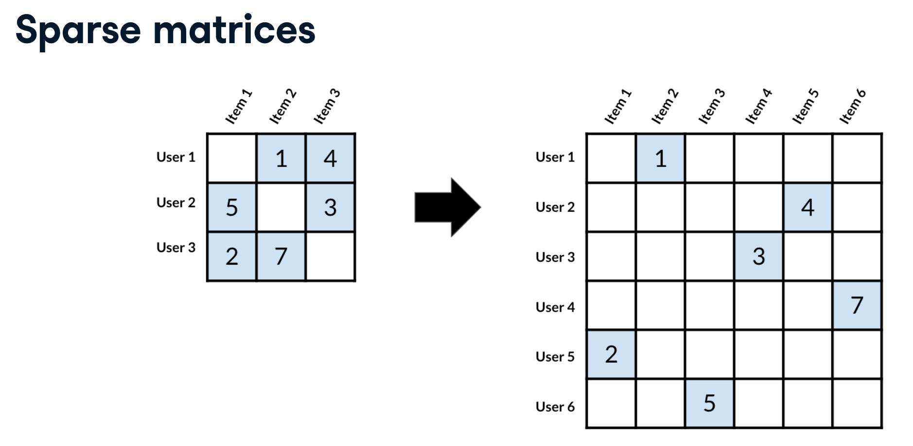
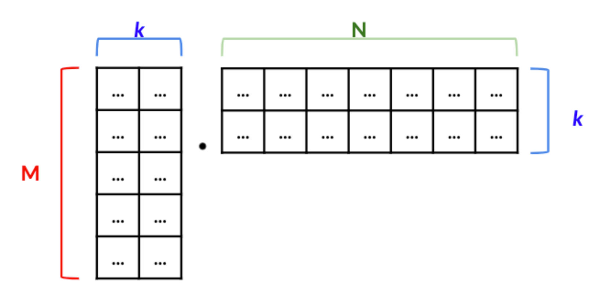

# Building recommendation systems

Notes from [Datacamp's course](https://learn.datacamp.com/courses/building-recommendation-engines-in-python), [Eugene Yan's blog](https://eugeneyan.com/tag/recsys/) and elsewhere.

> Recommendation engines target a specific kind of machine learning problem, they are designed to suggest a product, service, or entity to a user based on other users, and their own feedback.

There is a many-to-many relationship between the items being recommended and the users. Users interact with many items. Each item is interacted with by many users.

- a better recommendation can be made for an item that has been given a lot of feedback
- more personalised recommendations can be given for a user that has given a lot of feedback (signal/interactions)

How a user's preferences are measured falls into two main groups; (1) implicit feedback and (2) explicit feedback;


## Non-personalised recommendations

Recommending items most commonly paired.

For example, if a user rates "The Great Gatsby" 5 stars, recommend the `most read` books of other users who also rated it 5 stars.

Alternatively, create a ranking system for books, for example `average rating`, or `average rating * customers read` or set a threshold in terms of popularity (read by x number); and provide the highest ranked books as recommendations.

```Python
# recommend what's most popular

# take the 50 most popular
movie_popularity = user_ratings_df["title"].value_counts()
popular_movies = movie_popularity[movie_popularity > 50].index
popular_movies_rankings =  user_ratings_df[user_ratings_df["title"].isin(popular_movies)]

# sort by their average rating
average_rating_df = popular_movies_rankings[["title", "rating"]].groupby('title').mean()
sorted_average_ratings = average_rating_df.sort_values(by="rating", ascending=False)
```

You can create pairs of items, the item most commonly seen with A. _Note_ we want both permutations, i.e. order matters;


```Python
import pandas as pd
from itertools import permutations
from typing import List

def create_pairs(x: List[str]) -> pd.DataFrame:
    pairs = pd.DataFrame(list(permutations(x.values, 2)),
        columns=["book_a", "book_b"]
        )

    return pairs

book_pairs = book_df.groupby("user_id")["book_title"].apply(create_pairs).reset_index(drop=True)
pair_counts = book_pairs.groupby(["book_a", "book_b"]).size()
pair_counts_df = pd.to_frame(name="size").reset_index()
pair_counts_df.sort_values(by="size", ascending=False, inplace=True)

# most common books after someone has read LotR
pair_counts_df[pair_counts_df.book_a == "Lord of the Rings"].head()
```

## Content filtering

Recommending items similar to items a user has liked in the past. We need a notion of similarity between items.

Content based recommendations, prioritises items with similar attributes. This allows you to recommend new items, as well as leveraging a long-tail of items. Content filtering works well when we have a lot of information about the items, but not much data on how people feel about them.

> This system uses item metadata, such as genre, director, description, actors, etc. for movies, to make these recommendations. The general idea behind these recommender systems is that if a person liked a particular item, he or she will also like an item that is similar to it. [ref](https://www.kaggle.com/ibtesama/getting-started-with-a-movie-recommendation-system)

Encode attributes as a vector to easily calculate distance and similarity between items;


```Python
"""
# convert
|| title || genre ||
| book a | genre a |
| book a | genre b |
| book b | genre a |
| book b | genre c |

# to 
|| title || genre a || genre b || genre c ||
| book a |      1   |  1       |     0    |
| book b |      1   |  0       |     0    |
"""

df = pd.crosstab(df_books.title, df_books.genre).reset_index()

df[df.index == "Lord of the Rings"]
```

### Calculating similarity

The `Jaccard Similarity` is the ratio of attributes two items have in common / by the total number of combined attributes

$\cap$ = intersection (overlap) between two arrays

$\cup$ = union (all elements) in two arrays


```Python
# similarity between two items
from sklearn.metrics import jaccard_score

print(jaccard_score(
    np.asarray(df_book.loc["The Hobbit"].values), 
    np.asarray(df_book.loc["A Game of Thrones"].values)
))

# similarity between all items at once
from scipy.spatial_distance import pdist, squareform

#  pdist == pairwise distance
jaccard_distances = pdist(df_books.values, metric="jaccard")

# turns 1d array into nested-array
# subtract values from 1 as jaccard is a measure of difference
sq_jaccard_distances = 1 - squareform(jaccard_distances)

distance_df = pd.DataFrame(sq_jaccard_distances,
                            index=df_books.index,
                            columns=df_books.index)


def similarity(title1: str, title2: str, df: pd.DataFrame) -> int:
    """returns the similarity score of two books"""
    return df[title1][title2]
```

Resulting dataframe;


`Cosine Similarity`

#### Cosine versus Jaccard

From Data Science Stack Exchange [ref](https://datascience.stackexchange.com/questions/5121/applications-and-differences-for-jaccard-similarity-and-cosine-similarity)

Jaccard Similarity;

$$s_{ij} = \frac{p}{p+q+r}$$

Where;

- $p$ = # of attributes positive for both objects (intersection)
- $q$ = # of attributes 1 for $i$ and 0 for $j$
- $r$ = # of attributes 0 for $i$ and 1 for $j$

Cosine Similarity;

$$\frac{A \cdot B}{\|A\|\|B\|}$$

${\|vector\|}$ - is a scalar, denoting the Euclidean norm of the vector (square root of the sum of squares)

> In cosine similarity, the number of common attributes is divided by the product of A and B's distance from zero. It's a measure of distance in high dimensions.


> Whereas in Jaccard Similarity, the number of common attributes is divided by the number of attributes that exists in at least one of the two objects.

In cosine similarity all values are between 0 and 1, where 1 is an exact match.

Cosine similarity is better for working with features that have more variation in their data, as opposed to attributes being boolean.

### Working without clear attributes

Often it will not have clear attribute labels relating to an item. However, if the item has text tied to it, we can use this description, or any text related to the item to create labels. This process is known as "Term Frequency Inverse Document Frequency" or TF-IDF to transform the text into something usable.


By dividing the the count of word occurrences by total words in the document we reduce the impact of of common words.

```Python
from sklearn.feature_extraction.text import TfidfVectorizer
from sklearn.metric.pairwise import cosine_similarity

# min_df -> only include words that occur at least twice
# max_df -> exclude words that occur in over 70% of descriptions
vectorizer = TfidfVectorizer(min_df=2, max_df=0.7)

vectorised_data = vectorizer.fit_transform(df_books.descriptions)

vectorised_data.to_array()  # row for each book, column for each feature

tfidf_df = pd.DataFrame(vectorised_data.to_array(),
                        columns=vectorizer.get_feature_names()
                        )
tfidf_df.index = df_books.book_titles  

# similarity between all rows
cosine_s_array = cosine_similarity(tfidf_df)

# plot a matrix book x book
cosine_similarity_df = pd.DataFrame(cosine_similarity_array, 
                            index=tfidf_df.index, 
                            columns=tfidf_df.index
                        )

# similarity between two rows
cosine_s = cosine_similarity(
                tfidf_df.loc["The Hobbit"].values.reshape(1, -1),
                tfidf_df.loc["Macbeth"].values.reshape(1, -1)
            )

# get similarities for a particular title
cosine_similarity_df.loc["Lord of the Rings"].sort_values(ascending=False)
```

### Presenting tastes in user profiles

Take all the items a user has engaged with and create mean scores across each attribute to create a "taste profile".

```Python
# list of title the user has read and enjoyed
user_books = df_user.books_enjoyed[df_user.user="1234"].values

books_enjoyed_df = tfidf_summary_df.reindex(user_books)  # df of books as rows, attributes as columns

user_tastes = books_enjoyed_df.mean()  # array of mean of column value

# to recommend, 
    # remove books already liked
tfidf_subset_df = tfidf_summary_df.drop(user_books, axis=0)

    # Calculate the cosine_similarity and wrap it in a DataFrame
    # columns is number of features
similarity_array = cosine_similarity(user_tastes.values.reshape(1, -1), tfidf_subset_df)

similarity_df = pd.DataFrame(similarity_array.T, 
                    index=tfidf_subset_df.index, 
                    columns=["similarity_score"]
                )
sorted_similarity_df = similarity_df.sort_values(
                            by="similarity_score",
                            ascending=False
                        )
```

## Collaborative filtering

Collaborative filtering finds users that have the most similar preferences to the user we are making recommendations for and based on that group's preferences, make suggestions.

> Collaborative filtering uses information on user behaviours, activities, or preferences to predict what other users will like based on item or user similarity. In contrast, content filtering is based solely on item metadata (i.e., brand, price, category, etc.). _-- Eugene Yan_

> This system matches persons with similar interests and provides recommendations based on this matching. Collaborative filters do not require item metadata like its content-based counterparts. [ref](https://www.kaggle.com/ibtesama/getting-started-with-a-movie-recommendation-system)

We need to transform data into a matrix of users and the items they rated.

<br>

> Based on this matrix we can compare across users, here it is apparent that User_1 and User_3 have more similar preferences than User_1 and User_2.

### Handling sparse data

This matrix will be extremely sparse. Users won't have a expressed a positive or negative view towards the majority of items, you can't simply drop `NULLS` or fill in missing values with 0 (this is will impact our calculations).

One approach is to centre all the ratings around 0. 0 will therefore represent a neutral rating.


Do this by subtracting the user's mean rating from each score.

```Python
# make user_id the index, each column a move, each cell a rating
user_ratings_table = user_ratings.pivot(index="userId", columns="title", values="rating")

# each row represents a users mean rating
user_avg_rating = user_ratings_pivot.mean(axis=1)

# from each column, subtract the user's mean rating
user_ratings_pivot = user_ratings_pivot.sub(user_avg_rating, axis=0)
user_ratings_pivot.fillna(0)
```

These values should not be used for prediction. Only for comparing users.

Take the following example. Both users `B` and `C` are equally similar to user `A`. We cannot predict what the user will think of "The Matrix". If you filled `NULL` values with 0, you'd artificially make user `C` look more similar to user `A`.


### Item-based collaborative filtering

We can also find similarities between products simply by looking at the ratings they have received.

```Python
# transpose each user's rating of each film
# so that film titles are the index, user ratings the columns
move_ratings = user_ratings_table.transpose()
```


_Note: It appears that this does take into account who has rated the film, not simply the mean and distribution of ratings._ 

`cosine_similarity(sw_IV, sw_V) = [0.5357054]` despite the average rating between pretty different. Whereas Pulp Fiction and Star Wars 4 have a more similar rating on avarage, yet `cosine_similarity(sw_IV, pulp_fiction) = [-0.08386681]`.

```Python
from sklearn.metrics.pairwise import cosine_similarity

# with similarity scores centred around 0, cosine will be between -1 to 1
similarities = cosine_similarity(movie_ratings_centered)

cosine_similarity_df = pd.DataFrame(similarities, index=movie_ratings_centered.index, columns=movie_ratings_centered.index)

# Find the similarity values for a specific movie
cosine_similarity_series = cosine_similarity_df.loc['Star Wars: Episode IV - A New Hope (1977)'].sort_values(ascending=False)
```

### Using K-nearest neighbours

Predicting how a user might rate an item they have not yet seen. One approach is to find similar users using a K nearest neighbors model and see how they liked the item.


`K-NN` finds the k users that are closest measured by a specified metric, to the user in question. It then averages the rating those users gave the item we are trying to get a rating for.


Once you have a matrix of user similarities


```Python
# for a user get the 10 most similar
user_similarity_series = user_similarities.loc['user_001'].sort_values(ascending=False)
nearest_neighbors = user_similarity_series[1:11].index  # provides a list of user_ids

neighbor_ratings = user_ratings_table.reindex(nearest_neighbors
                    )  # reindex filters the df to list of users provided

print(neighbor_ratings['Apollo 13 (1995)'].mean()
    ) # mean rating users most similar to user_001 gave the film
```

Getting the data for prediction

- `target_user_x` - Centred ratings that `user_001` has given to the movies they have seen.
- `other_users_x` - Centred ratings for all other users and the movies they have rated excluding the movie Apollo 13.
- `other_users_y` - Raw ratings that all other users have given the movie Apollo 13.

```Python
# Drop the column you are trying to predict
users_to_ratings.drop("Apollo 13 (1995)", axis=1, inplace=True)

# Get the data for the user you are predicting for
target_user_x = users_to_ratings.loc[["user_001"]]

# Get the target data from user_ratings_table - not centred around 0
other_users_y = user_ratings_table["Apollo 13 (1995)"]

# Get the data for only those that have seen the movie
other_users_x = users_to_ratings[other_users_y.notnull()]

# Remove those that have not seen the movie from the target
other_users_y.dropna(inplace=True)

from sklearn.neighbors import KNeighborsRegressor

user_knn = KNeighborsRegressor(metric="cosine", n_neighbors=3)

# other_users_x = how users rated every other item in the catalogue
# other_users_y = how users rated the item in question
user_knn.fit(other_users_x, other_users_y)

# target_user_x = how the user in question has rated every item to date
user_user_pred = user_knn.predict(target_user_x)
user_user_pred  # now contains the predicted avg rating the user would give the item it has not seen
```

## Item-based versus user-based filtering

> user-based collaborative filtering finds similar users to the one you are making a recommendation for and suggests items these similar users enjoy. Item-based collaborative filtering finds similar items to those that the user you are making recommendations for likes and recommends those.

> any given movie can, to a rough degree of approximation, be described in terms of some basic attributes such as overall quality, whether it's an action movie or a comedy, what stars are in it, and so on. And every user's preferences can likewise be roughly described in terms of whether they tend to rate high or low, whether they prefer action movies or comedies, what stars they like, and so on. -- Simon Funk, on the Netflix Prize

Pros of __item based filtering__;

- The meta-data relating to items is stationery, whereas user preferences change over time
- The recommendations are often easier to explain (both to the consumer and business folks), "we are recommending x because you liked y"
- Similarities between products can be pre-computed. Each day the items in the inventory and the similarity between them can be calculated offline

Cons of __item based filtering__;

- The recommendations are typically very obvious. Recommending the next episode in a series or "another wallet" may not be very valuable (though it may be for songs)

__User based filtering__ can provide much more novel suggestions

- One of the pros of __user based filtering__ is finding less popular items 

## Matrix factorisation and validating your predictions

Commonly, we deal with sparse matrices, where a large number of items have not be reviewed by multiple people.

_Note_, the "user-rating" matrix is the heart and soul of recommendation engines. The matrix will have `# users` * `# items`



`sparsity = df.isnull().sum() / df.size`

The aim of recommendation systems is often to "fill in the blanks" of this matrix

- In the Netflix Price they adopted `mean squared error` as the measure of accuracy, if you guess 1.5 and the actual rating was 2, you get docked for $(2 - 1.5)^2$ points, or 0.25

This creates two problems; 

(1) algorithms such as nearest neighbours cannot handle nulls values, 

(2) we often use the mean rating of a product from similar users or products, filtering down to similarity might result in getting the mean from a very small subset, distorting the numbers (i.e. we lose the law of large numbers and may be greatly influenced by a single outlier)

__Matrix factorisation__ is commonly used in recommendation systems.

From Wikipedia:

> Matrix factorization algorithms work by decomposing the user-item interaction matrix into the product of two lower dimensionality rectangular matrices.
> 
> This family of methods became widely known during the Netflix prize challenge due to its effectiveness as reported by Simon Funk in his 2006 [blog post](https://sifter.org/~simon/journal/20061211.html)

From "Essential Math for Data Science"

> Matrix decomposition is the process of splitting a matrix into multiple pieces. For instance, selecting a subset of the data to reduce dimensionality without losing much information (e.g. Principal Component Analysis)

### Notes from Simon Funk

- If meaningful generalities can help you represent your data with fewer numbers, finding a way to represent your data in fewer numbers can often help you find meaningful generalities.
- In practice this means defining a model of how the data is put together from a smaller number of parameters, and then deriving a method of automatically inferring from the data what those parameters should actually be.  
  - this is `singular value decomposition`
- We'll assume that a user's rating of a movie is composed of a sum of preferences about the various aspects of that movie.
  - For example, imagine that we limit it to forty aspects, such that each movie is described only by forty values saying how much that movie exemplifies each aspect, and correspondingly each user is described by forty values saying how much they prefer each aspect.
  - To combine these all together into a rating, we just multiply each user preference by the corresponding movie aspect, and then add those forty leanings up into a final opinion of how much that user likes that movie.
  - E.g., Terminator might be (action=1.2,chickflick=-1,...), and user Joe might be (action=3,chickflick=-1,...), and when you combine the two you get Joe likes Terminator with 3*1.2 + -1*-1 + ... = 4.6+... . Note here that Terminator is tagged as an anti-chickflick, and Joe likewise as someone with an aversion to chickflicks, so Terminator actively scores positive points with Joe for being decidedly un-chickflicky. (Point being: negative numbers are ok.) 
  - all told that model requires 40*(17K+500K) values, or about 20M -- 400 times less than the original 8.5B (17K movies * 500K users).
  - `ratingsMatrix[user][movie] = sum (userFeature[f][user] * movieFeature[f][movie]) for f from 1 to 40`
  - In matrix terms, the original matrix has been decomposed into two very oblong matrices: the 17,000 x 40 movie aspect matrix, and the 500,000 x 40 user preference matrix.
  - Multiplying those together just performs the products and sums described above, resulting in our approximation to the 17,000 x 500,000 original rating matrix. 
  - Singular value decomposition is just a mathematical trick for finding those two smaller matrices which minimize the resulting approximation error--specifically the mean squared error
  - If you write out the equations for the error between the SVD-like model and the original data --just the given values, not the empties-- and then take the derivative with respect to the parameters we're trying to infer, you get a rather simple result
- `userValue[user] += lrate * err * movieValue[movie];`
- `movieValue[movie] += lrate * err * userValue[user];`
  - Lrate is the learning rate, a rather arbitrary number which I fortuitously set to 0.001 on day one and regretted it every time I tried anything else after that
  - Err is the residual error from the current prediction

- You would think the average rating for a movie would just be... its average rating! Alas, Occam's razor was a little rusty that day. 
- Trouble is, to use an extreme example, what if there's a movie which only appears in the training set once, say with a rating of 1. Does it have an average rating of 1? Probably not! In fact you can view that single observation as a draw from a true probability distribution who's average you want... and you can view that true average itself as having been drawn from a probability distribution of averages, the histogram of average movie ratings essentially.
- If we assume both distributions are Gaussian, then according to my shoddy math the actual best-guess mean should be a linear blend between the observed mean and the apriori mean, with a blending ratio equal to the ratio of variances.
- The point here is simply that any time you're averaging a small number of examples, the true average is most likely nearer the apriori average than the sparsely observed average.
- This is essentially equivalent to penalizing the magnitude of the features, and so is probably related to [Tikhonov regularisation](https://en.wikipedia.org/wiki/Tikhonov_regularization) (_a special case of ridge regression, ridge regression is particularly useful to mitigate the problem of multicollinearity in linear regression_). The point here is to try to cut down on over fitting, ultimately allowing us to use more features.

### Matrix multiplication

When multiplying two matrices, the `k` must be equal (rows of the first matrix and columns of the second)



****

Ref: https://towardsdatascience.com/intro-to-recommender-system-collaborative-filtering-64a238194a26
